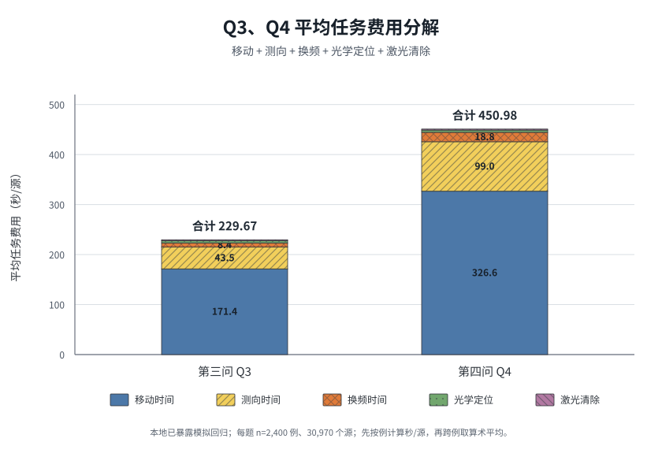

# 多圆清除、安全行动域与时间成本分解

日期：2026-09-13。本文档汇总两项Q3完整任务消融，以及当前B3方法的Q3/Q4时间成本分解。两项消融使用冻结的1200个 `LOCAL-v1` 核心Q3案例；时间分解使用B3保存的两批共4800行Q3/Q4记录。所有数据均属于已暴露的本地模拟回归，不是盲测或官方Windows成绩。

## 一、完整任务消融结论

| 建模亮点 | 完整策略 | 对照策略 | 完整策略减少 | 相对改善 | seed簇bootstrap 95%区间 |
|---|---:|---:|---:|---:|---:|
| 自适应多圆清除 | 229.196347秒/源 | 禁用多圆：229.871723秒/源 | **0.675376秒/源** | **0.293806%** | **[-0.844716,-0.494305]** |
| 完整安全行动域 | 229.196347秒/源 | MEC中心：229.904617秒/源 | **0.708271秒/源** | **0.308072%** | **[-0.816170,-0.593080]** |

两项实验各包含1200对、2400次新策略执行，全部清除15550个源并正常退出。区间按100个seed簇重采样，每个簇同时保留12种场景，重复20000次。两个区间均低于0，说明在当前本地回归中平均收益稳定；改善均小于0.5%，不能向上表述为0.5%左右。

两项结果来自分别相对完整B3的单因素消融，不能相加为0.602%。

## 二、自适应多圆清除

当一次清除圆无法覆盖当前源位置可行域 `P` 时，完整策略不一定继续测向，而是寻找有限组清除点 `q_1,\ldots,q_k`，满足

$$
P\subseteq\bigcup_{j=1}^{k}B(q_j,20).
$$

依次访问这些点并执行光学试清，只要覆盖证书成立，就能在有限次动作内完成清除。关闭臂绕过B3的自适应2圆、3圆和多圆服务层，回到继续测向、单点试清及原25米格点终端兜底；其他定位、调度和恢复逻辑保持相同。

| 指标，逐例平均 | 多圆开启 | 多圆关闭 | 开启减关闭 |
|---|---:|---:|---:|
| 秒/源 | 229.196347 | 229.871723 | **-0.675376** |
| 测向次数/局 | 108.115833 | 111.307500 | **-3.191667** |
| 光学尝试次数/局 | 18.860000 | 16.325833 | +2.534167 |
| 失败试清次数/局 | 5.901667 | 3.367500 | +2.534167 |
| 移动距离/局 | 10838.404米 | 10831.641米 | +6.763米 |

完整策略实际执行6588份自适应多圆计划；关闭臂执行数为0。1200局中896局更快、36局相同、268局更慢。收益来源不是路程缩短，而是用平均每局增加2.534次失败试清，换取减少3.192次费用更高的测向。`origin_cluster`是唯一平均退步场景，多圆开启平均慢2.082829秒/源。

因此，论文可以写成：**多圆覆盖将“继续获得更精确位置”转化为“直接规划一组保证完成的动作”，并在完整任务中以更多低成本光学试清替代部分测向，平均降低0.294%的任务时间。**

## 三、安全行动域

当源位于凸多边形 `P` 时，全部能够保证一次清除成功的机器人位置构成

$$
\mathcal C_{\rm clear}(P)
=\bigcap_{v\in V(P)}B(v,20).
$$

最小包围圆中心只是该集合中的一个点。完整策略在安全行动域内结合当前位置和下一服务点选择落点；对照臂在相同认证时刻永远前往最小包围圆中心。两臂的发现、定位、多圆清除和调度规则保持一致。

| 指标，逐例平均 | 完整行动域 | MEC中心 | 完整减中心 |
|---|---:|---:|---:|
| 秒/源 | 229.196347 | 229.904617 | **-0.708271** |
| 测向次数/局 | 108.115833 | 108.115833 | 0 |
| 光学尝试次数/局 | 18.860000 | 18.795833 | +0.064167 |
| 失败试清次数/局 | 5.901667 | 5.837500 | +0.064167 |
| 移动距离/局 | 10838.404米 | 10884.868米 | **-46.464米** |

完整行动域在1103局中更快、1局相同、96局更慢。16611个认证落点均覆盖对应可行多边形的全部顶点，最大顶点距离为19.999999900米。完整策略的时间变化可分解为：移动 `-0.715174`、测向 `-0.005264`、换频 `-0.001029`、clear费用 `+0.013196` 秒/源，合计 `-0.708271` 秒/源。

因此，论文可以写成：**安全行动域把源的位置不确定性转化为机器人的行动自由度；在不增加测向总数的情况下，平均每局少移动46.464米，使完整任务时间下降0.308%。**

## 四、Q3与Q4时间成本分解

每局任务费用严格拆为

$$
T=
\underbrace{\frac{D}{5}}_{\text{移动时间}}
+\underbrace{5N_m}_{\text{测向时间}}
+\underbrace{N_s}_{\text{换频时间}}
+\underbrace{3N_c}_{\text{光学定位}}
+\underbrace{2N_{\rm success}}_{\text{激光清除}}.
$$

其中 `D` 为总移动距离，`N_m` 为测向次数，`N_s` 为测向时发生的频道切换次数，`N_c` 为所有clear尝试次数。每次clear先支付3秒光学定位费，成功后再支付2秒激光清除费。

**图注：** 第三、四问平均任务费用分解。每题包含2400个已暴露本地模拟案例和30970个干扰源；先对每局用五项费用分别除以本局清除数，再对2400局取算术平均。五项严格加和为保存的平均总虚拟时间。

| 问题 | 移动时间 | 测向时间 | 换频时间 | 光学定位 | 激光清除 | 合计 |
|---|---:|---:|---:|---:|---:|---:|
| Q3 | 171.409076 | 43.507022 | 8.369292 | 4.384453 | 2.000000 | **229.669843** |
| Q4 | 326.644584 | 99.018814 | 18.809539 | 4.507484 | 2.000000 | **450.980422** |

单位均为秒/源。Q4相对Q3增加221.310579秒/源：

| 增量来源 | Q4−Q3，秒/源 | 占总增量 |
|---|---:|---:|
| 移动 | 155.235509 | 70.1437% |
| 测向 | 55.511792 | 25.0832% |
| 换频 | 10.440247 | 4.7175% |
| 光学定位 | 0.123031 | 0.0556% |
| 激光清除 | 0 | 0% |

移动、测向和换频合计解释99.9444%的跨题时间增量。该结果与“定向源需要更密集的方向鲁棒发现扫描和补测”一致；它是对当前B3及本地模拟世界的描述性分解，不能单独证明全部差异都由未知发射朝向造成。

## 五、数据与复核入口

- [两项完整任务消融总报告](../agent_experiments/20260913_fulltask_geometry_ablations/RESULTS.md)
- [多圆清除逐项报告](../agent_experiments/20260913_fulltask_geometry_ablations/multidisc/RESULTS.md)
- [安全行动域逐项报告](../agent_experiments/20260913_fulltask_geometry_ablations/safe_action/RESULTS.md)
- [时间分解作图数据CSV](../agent_experiments/20260913_time_cost_breakdown/chart_data.csv)
- [逐题汇总CSV](../agent_experiments/20260913_time_cost_breakdown/question_summary.csv)
- [4800行逐例费用数据](../agent_experiments/20260913_time_cost_breakdown/per_case_costs.csv)
- [高分辨率PNG](../agent_experiments/20260913_time_cost_breakdown/time_cost_breakdown_q3_q4.png)
- [可编辑SVG](../agent_experiments/20260913_time_cost_breakdown/time_cost_breakdown_q3_q4.svg)
- [时间分解计算口径](../agent_experiments/20260913_time_cost_breakdown/METHOD.md)

两项消融总审计16/16通过；多圆分报告验证通过；安全行动域31/31通过；时间成本分解21/21通过。主solver、最佳方法和冻结evaluation均未修改。

