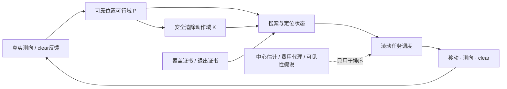
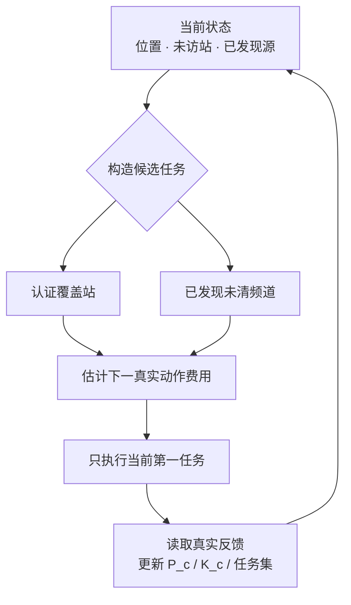
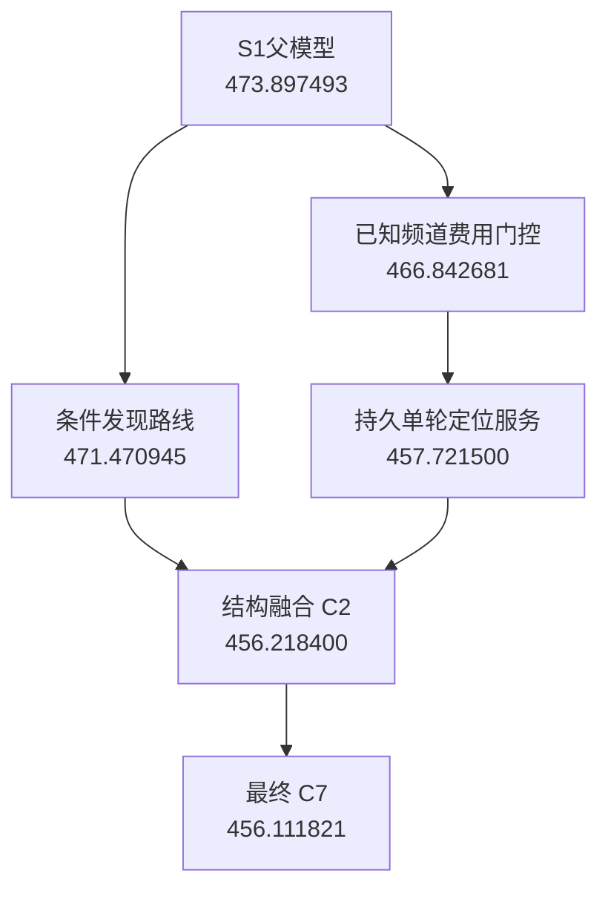

# 论文图表源码 v1

> 目标：把当前正文中的关键图转换成“可直接渲染/重画”的统一图源。Mermaid可直接在GitHub预览；几何图给出明确元素、坐标和图注，后续用Matplotlib/TikZ统一渲染即可。

---

# 图1 全文统一框架

**图注：** 本文统一建模框架。可靠集合与证书决定“是否允许做”，规划代理决定“先做什么”。

---

# 图2 Q1 测向角带与可行域

建议用TikZ/Matplotlib重画，不用ASCII。

## 元素

- 三个检测点 $S_1,S_2,S_3$；
- 每个检测点画中心示向线；
- 中心线两侧各画 $1^\circ$ 边界；
- 半透明填充三个角带；
- 三者公共交集高亮为凸多边形 $P$。

## 图上只标

- `$\theta_i\pm1^\circ$`
- `位置可行域 $P$`
- `检测点 $S_i$`

不要在图中放长解释。

**图注：** 有界测向误差下的角带约束与交会定位区域。

---

# 图3 Q1 40m等边三角形反例

直接按 `docs/第一问_定稿.md` 坐标作图：

- $S_1=(-1100,0)$，示向度 $1^\circ$；
- $S_2=(590,-550\sqrt3)$，示向度 $121^\circ$；
- $S_3=(570,570\sqrt3)$，示向度 $241^\circ$；
- 三个 $\pm1^\circ$ 扇区交得到边长40m等边三角形。

## 同图叠加

- 三角形三边；
- 最小包围圆；
- 一条40m边标注“直径=40m”；
- 包围圆标注 `$R=40/\sqrt3\approx23.094m>20m$`。

**图注：** 定位区域直径为40m仍不能保证存在半径20m的覆盖圆。

---

# 图4 Q1 位置可行域与安全清除域

给定示意凸多边形 $P$，以每个顶点 $v_i$ 为圆心画半径20m圆盘轮廓，突出共同交集：

\[
K(P)=\bigcap_i B(v_i,20).
\]

- $P$ 用浅色填充；
- 各20m圆只画细边界；
- $K(P)$ 用深色填充；
- 在 $K(P)$ 中选一点 $q$。

**图注：** 安全清除动作域：从该区域内任一点执行clear，均能覆盖所有仍可能的真实源位置。

---

# 图5 Q2 稳保接收候选域

局部坐标系：首测点 $S_1=(0,0)$，首次示向沿 $+x$ 轴。

## 画三圆交

半径均为1000m，圆心：

- $(0,0)$；
- $(1000\cos\delta,1000\sin\delta)$；
- $(1000\cos\delta,-1000\sin\delta)$；

其中 $\delta=1^\circ$。

三个圆盘公共交集即保守稳保区域。

## 叠加

- 首测 $\pm1^\circ$ 角带；
- 候选点 $(600,300)$、$(600,-300)$；
- 一条纯横向点示意为“不保证接收”的反例位置。

**图注：** 未知接收半径下的稳保第二测点安全子域。

---

# 图6 Q3 七点全向覆盖

中心：原点 $O$。

六个环站半径：

\[
\rho=1124m,
\]

极角分别为 $0,60^\circ,\ldots,300^\circ$。

目标区域外圆半径1800m；再画原点1000m接收圆作参考。

## 最坏几何

取源 $g$ 与最近环站夹角 $30^\circ$，在图中标出：

- $r\in[1000,1800]$；
- $\varphi\le30^\circ$；
- `最坏端点 d(1800,30°)≈999.55m`。

**图注：** 原点与六等角环站对全向干扰源的解析覆盖证书。

---

# 图7 Q3 可靠可行域收缩

建议做成四格横图：

1. 目标圆域 $D$；
2. 第一次direction后：$D\cap W_1$；
3. 第二次direction后：$D\cap W_1\cap W_2$；
4. 收缩到出现非空安全清除域 $K_c$。

第三格可加一个Q3真实no_signal圆排除的示意，但要注明“仅全向源可用”。

**图注：** 真实观测逐步收缩可靠位置集合并触发认证清除。

---

# 图8 搜索站—待清源滚动联合调度

**图注：** 滚动联合调度：每次只执行首任务，真实观测到达后重新规划。

---

# 图9 Q4 定向源no_signal歧义

左右双图。

## 左图：正面

- 源 $g$；
- 半圆发射区域朝向机器人；
- 机器人距源<1000m；
- 标注 `direction/near`。

## 右图：背面

- 源位置和距离相似；
- 发射半平面转180°；
- 机器人位于背面；
- 标注 `no_signal despite short distance`。

**图注：** 定向源条件下，无信号不能直接解释为距离超过最小接收半径。

---

# 图10 Q4 21站连续可见性证书

主图画21个认证站和1800m目标圆域。

旁边放一个局部放大 inset：

- 一个局部区域 $Q$；
- 若干共同1000m邻近站 $v_1,v_2,v_3,\ldots$；
- 画它们的凸包；
- 真源 $s\in Q\subseteq\operatorname{conv}(v_i)$；
- 过 $s$ 画任意半平面边界；
- 至少一个 $v_i$ 位于有效发射半平面中。

**图注：** 21站连续覆盖的局部凸包证明示意。

---

# 图11 Q4 no_signal反向楔排除

给定两个真实正接收点 $p_1,p_2$ 和一个无信号点 $q$。

画两条反向向量：

\[
q-p_1,\qquad q-p_2.
\]

由它们张成反向锥：

\[
q+\operatorname{cone}(q-p_1,q-p_2).
\]

该区域着红色斜线，标注“不可能是真源”；原可靠多边形 $P$ 用浅蓝色；实际实现后的凸外包用蓝色虚线。

**图注：** 利用接收域凸性从真实正、负观测得到的保守无信号反向楔约束。

---

# 图12 Stage4 主收益链

该图可直接引用 `experiments/R1_atlas/STAGE4_PROGRESS.md`，正文建议使用压缩版本：

**图注：** 第四问主要模型升级与固定回归平均定位清除时间。

---

# 表1 动作费用

|动作|费用|
|---|---:|
|移动距离$d$|$d/5$s|
|切换频道|1s|
|测向|5s|
|光学定位|3s|
|成功清除|2s|

---

# 表2 Stage4关键模型升级

|策略|主要新增机制|Q4平均时间/(s·源$^{-1}$)|相对S1|
|---|---|---:|---:|
|S1|Stage3稳定父模型|473.897493|—|
|E1-R1|条件发现路线|471.470945|-0.5120%|
|E2-R1-station|已知频道重测费用门控|466.842681|-1.4887%|
|E2-R2|状态持久的单轮定位服务|457.721500|-3.4134%|
|C7|结构融合+两个保守负信息组件|**456.111821**|**-3.7531%**|

---

# 表3 耗时构成

|策略|总耗时/源|移动/源|其他动作/源|请求/局|
|---|---:|---:|---:|---:|
|S1|473.897493|340.531263|133.366230|282.708|
|E2-R1-station|466.842681|341.042934|125.799748|267.142|
|E2-R2|457.721500|331.795897|125.925602|266.128|
|C2|456.218400|331.285892|124.932508|263.695|
|C7|**456.111821**|**331.334370**|**124.777451**|**263.066**|

---

# 表4 配对稳健性

|对照|快|同|慢|结论|
|---|---:|---:|---:|---|
|C7 vs S1|1995|2|403|12类场景均值全部改善，但非逐局占优|

最大单局退步：128.753327 s/源。

---

# 图表排版建议

正文控制在约10–12幅核心图：

- 图1统一框架；
- 图3 Q1反例；
- 图5 Q2稳保域；
- 图6 Q3覆盖；
- 图7 Q3集合收缩；
- 图8滚动调度；
- 图9 Q4观测失效；
- 图10 Q4 21站覆盖；
- 图11负楔；
- 图12 Stage4收益链。

图2、图4如果篇幅紧，可以与图3/图7合并。

表只保留动作费用、关键升级、耗时构成、官方测试。其余完整研发大表进入支撑材料。