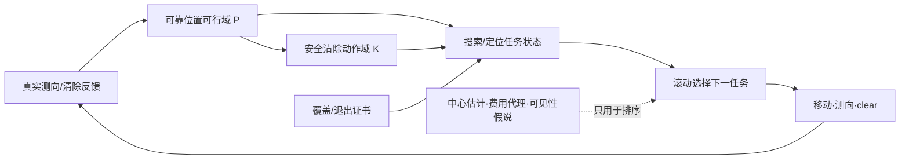
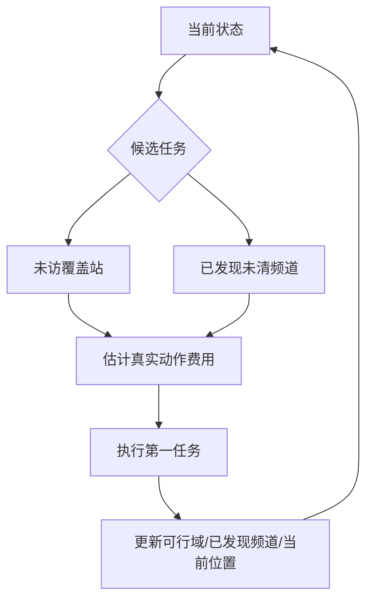
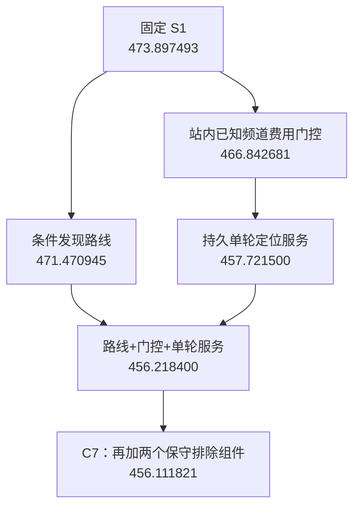

# 基于几何可行域证书与滚动联合调度的无线电干扰源快速定位与清除

> **版本：正文初稿 v3。** 本版在 v2 基础上完成三项整合：① 将 Stage 4 已有 Mermaid 主收益链和核心实验表直接纳入正文；② 增加与方法选择直接相关的 related work，并严格区分“文献启发”与“本文实际采用”；③ 整理第一版参考文献。当前 4800 个本地案例均属于已暴露研发回归，题目要求的第三、四问三次官方正式测试仍待填写，不用本地结果替代。

---

# 摘要

针对无线电干扰源定位清除过程中存在的有界测向误差、接收半径未知、源数量与频道未知以及定向源部分可见等问题，本文围绕“**如何表示位置不确定性、何时能够保证清除、如何在保证全部清除的前提下降低任务时间**”建立统一模型。首先，将每次带有 $\pm1^\circ$ 误差的示向度表示为角带约束，通过半平面交构造干扰源位置可行域。针对问题一，指出仅依据定位区域直径无法判断是否存在半径20 m的保证清除圆，并构造边长40 m的等边三角形反例；据此进一步以最小包围圆和安全清除动作域刻画真正与清除动作相匹配的几何条件。针对问题二，在接收半径未知的条件下，先构造对所有首测相容场景均保证不断信号的稳健第二测点候选域，再在候选域内兼顾交会几何与移动成本。

针对多源在线任务，本文将“**正确性证书**”和“**效率优化**”分离。问题三中，利用原点与六个等角环形站构造全向源搜索覆盖证书，对每个已发现频道持续维护可靠位置可行域，并在未访问覆盖站与已发现未清源之间进行滚动联合调度；安全清除只由可靠几何集合决定，而中心估计、路径代理等仅用于任务排序。问题四中，由于定向源存在“距离很近但位于发射背面仍无信号”的现象，第三问中的负观测规则不再成立，因此重新采用具有连续可见性证明的21站覆盖结构，并进一步引入条件发现路线、已知频道重测费用门控以及可中断且状态持久的单轮定位服务。对于真实无信号观测，本文利用接收区域凸性推导出保守的反向楔形排除规则，使负信息在不错误删除真实源的前提下得到利用。

在固定本地回归环境中，所有晋级候选均首先满足全部清除和正常退出条件后再比较效率。当前稳定第三问方案平均定位清除时间为235.876946 s/源；第四问最终候选 C7 由阶段起点473.897493 s/源降至456.111821 s/源，2400个第四问题例中1995例更快、2例持平、403例变慢，且12类场景均值全部改善。费用分解表明，重测费用门控主要减少低价值测向开销，而单轮定位服务主要减少持续追踪单一目标造成的移动成本。上述结果用于研发回归、消融与机理解释而非独立泛化证明，最终性能以官方模拟器三次正式测试结果为准。

**关键词：** 无线电测向；有界误差；几何可行域；主动感知；在线调度；部分可观测

---

# 1 问题重述与总体分析

## 1.1 问题重述

题目要求机器狗利用无线电测向和光学清除能力处理区域内的干扰源。测向模块只能给出带有 $\pm1^\circ$ 有界误差的示向度；移动、频道切换、测向、光学定位和成功清除都会产生虚拟时间成本。因此任务目标不仅是“找到源”，还要求在保证全部清除的前提下尽可能降低平均定位清除时间。

四个问题构成逐步增强的决策链：问题一研究多次示向观测形成的位置不确定区域，并判断直径信息是否足以保证清除；问题二在已获得一次全向源有效示向的条件下选择第二检测点；问题三扩展到10–16个未知全向源和20个候选频道，要求机器狗自动完成发现、定位和清除；问题四进一步加入未知数量、未知发射方向的定向源，使“无信号”的含义发生根本变化，需要重新设计搜索与决策策略。

## 1.2 从点估计转向集合估计

一次示向观测并不能唯一确定干扰源位置。设检测点为 $S_i$，返回示向度为 $\theta_i$，理论误差上界为 $\delta=1^\circ$，则真实源 $g$ 只需满足

\[
\theta_i-\delta\le \arg(g-S_i)\le\theta_i+\delta .
\]

因此一次观测对应一个以 $S_i$ 为顶点的角带，而不是一条确定射线。多次观测后，真实源属于所有角带的公共部分；在第三、四问中，还可进一步与半径1800 m的目标区域先验相交。本文由此不直接估计一个“最可能坐标”，而维护所有仍与实际观测相容的位置集合。

这一选择与有界方位误差下的集合几何研究一致：Tokekar 和 Isler 等研究指出，在有界测向误差条件下，传感器布局与最坏情形定位区域需要直接从几何集合出发分析，而不能仅依赖高斯协方差近似[3]。但本文还额外包含接收范围、机器狗移动费用、频道切换费用和最终清除要求，因此不能直接照搬静态传感器布局结论。

## 1.3 定位精度与可清除性并不等价

若某定位区域直径不超过40 m，直观上容易认为取最长弦中点即可用半径20 m的清除范围覆盖整个区域。然而这一结论对一般二维集合并不成立。原因在于，直径只描述区域中最远两点间的距离，而清除要求存在**同一个中心点**，使所有可能源位置均落在其20 m邻域中。前者是最远点对问题，后者本质上是最小覆盖圆与公共服务域问题。

因此本文在问题一中进一步定义安全清除动作域，并将其作为第三、四问清除动作的统一判据。这里的核心不是“把定位做得尽量准”，而是把位置不确定性转换成一个**可执行动作是否具有确定成功保证**的问题。

## 1.4 从离线定位转向在线决策

问题三、四的难点不在于一次性解出所有干扰源坐标，而在于机器狗必须在执行过程中不断选择下一步动作。一次测向要增加检测费用，换频道也要付出时间；额外移动可能提高定位几何质量，也可能造成更大的路程损失；过早 clear 可能失败，过度测量又会浪费时间。

主动定位研究通常通过未来测量价值、协方差下降或多步观测树选择下一观测位置[1][2][4][5][6]。这些工作说明“下一步测哪里”必须与当前不确定性联动，但其 EKF、CRLB 或高斯噪声条件与本题的固定有界角误差不同。本文因此只吸收“**根据真实观测滚动重规划**”这一结构性思想，而将可靠状态始终保留为题设支持的几何集合。

全文统一流程如下。

图1反映全文最重要的分层：**覆盖证书、退出证书和安全清除域负责“不会漏、不会错”；中心估计、未来观测和路径启发式只负责“尽可能更快”。**

## 1.5 相关研究与本文方法选择

现有工作大致可分为三类。

**（1）有界误差下的方位集合几何。** Tokekar 和 Isler研究有界方位误差下的传感器布置与选择，并直接讨论最坏定位区域的直径与面积[3]。这一方向与本文的问题一最接近，支持用角带交而非概率点估计表示状态；但其静态布站、无接收半径和无旅行成本设定不能直接覆盖本题。

**（2）主动定位与非短视观测规划。** Tokekar、Vander Hook 和 Isler等从贪心、谨慎接近到多步在线规划研究移动测向传感器的主动定位[1][2][4][5]；Zhang 和 Tokekar进一步讨论非线性系统的有限未来观测树与剪枝[6]。这类方法提示我们应比较“信息收益”和“真实动作代价”。本项目也实际测试了条件化一/二层未来观测树，但新开发批次中收益反转，因此没有把更深规划作为最终方案。

**（3）多目标搜索与未发现目标管理。** Dames、Tokekar 和 Kumar将未知数量目标的发现与定位分开处理[7]；Engin 和 Isler使用联合 belief 和学习策略进行多目标主动定位[8]。这些工作提示“尚未发现”不能轻易等价为“不存在”，以及一个动作可能同时影响多个目标。但本题频道可辨、目标静止、每次检测明确计费，也不存在目标出生、死亡和数据关联问题，因此本文没有引入 PHD、TD3 等完整框架，而是保留可证明的覆盖站和显式动作费用。

由此本文的方法选择原则是：**可靠性采用本题可证明的几何与计数证书，效率优化再借鉴主动感知和滚动规划思想。** 文献方法只在满足本题动作、误差和费用定义后才进入最终策略。

---

# 2 模型假设、符号与费用

## 2.1 基本假设

1. 所有干扰源在一次测试过程中位置固定、频道固定，且不同干扰源频道互异；
2. 同一地点的测向误差在任务期间固定，因此不通过原地重复测量取平均的方式人为降低误差；
3. 问题三中的干扰源均为全向源；问题四允许全向源与定向源混合，定向源有效辐射区域为一个180°闭半平面与接收圆盘的交；
4. 光学定位与 clear 是否成功只与机器狗到真实源的距离有关，不受无线电发射方向影响；
5. 对未来观测、可见性或源位置构造的概率假说仅用于动作排序，不允许据此删除可靠可行域，也不作为清除成功的证明。

## 2.2 统一符号

第三、四问的目标圆域记为 $D$，半径1800 m。第 $i$ 个实际检测位置记为 $S_i=(x_i,y_i)$，对应示向度为 $\theta_i$；频道 $c$ 的可靠位置可行域记为 $P_c$，其顶点集合为 $V(P_c)$；安全清除动作域记为 $K_c$。

机器狗在时刻 $t$ 的位置记为 $x_t$；尚未访问的认证搜索站集合记为 $\mathcal S_t$；已经发现但尚未清除的频道集合记为 $\mathcal C_t$。滚动调度的待办任务统一写为

\[
\mathcal T_t=\mathcal S_t\cup\mathcal C_t.
\]

## 2.3 动作费用模型

题设动作费用统一写为

| 动作 | 虚拟时间 |
|---|---:|
| 移动距离 $d$ | $d/5$ s |
| 切换频道 | 1 s |
| 测向 | 5 s |
| 光学定位 | 3 s |
| 成功清除 | 2 s |

因此一次任务的总虚拟时间分解为

\[
T=T_{\mathrm{move}}+T_{\mathrm{switch}}+T_{\mathrm{measure}}+T_{\mathrm{optical}}+T_{\mathrm{clear}}.
\]

本文不构造题目未给出的综合评分，而只在“全部清除、正常退出”的候选之间比较平均定位清除时间。这样既避免通过少清除源人为降低均值，也能进一步解释模型改进究竟来自移动减少还是额外检测减少。

---

# 3 问题一：有界误差交会定位与安全清除判据

## 3.1 示向角带的半平面表示

设一次检测位置为 $S_i=(x_i,y_i)$，测得示向度为 $\theta_i$，角带上下边界方向为

\[
\alpha_i^- = \theta_i-\delta,\qquad \alpha_i^+=\theta_i+\delta.
\]

由二维叉积符号可将两条有向边界分别写成闭半平面，一次示向观测由两个半平面的交 $W_i$ 表示。若共有 $m$ 次有效示向，则**由观测本身确定的交会区域**为

\[
P=\bigcap_{i=1}^{m}W_i.
\]

该交集可能为空、无界或有界，必须先进行分类。数值实现可以使用足够大的工作框辅助裁剪，但不能把工作框截出的有限多边形误当作观测已给出有界定位区域。第三、四问另有半径1800 m目标域先验，此时才进一步令 $P_c\leftarrow D\cap P_c$。

## 3.2 定位区域直径

当 $P$ 为有界凸多边形时，其直径定义为

\[
\operatorname{diam}(P)=\max_{u,v\in P}\|u-v\|_2 .
\]

欧氏最远点对可在凸多边形顶点集合上取得，因此小规模情形可直接枚举顶点对；若顶点较多，也可采用旋转卡壳降低复杂度。

## 3.3 直径40 m并不足以保证清除

构造由三个实际角带交得到的边长40 m等边三角形。其直径为40 m，但最小包围圆半径为

\[
R=\frac{40}{\sqrt3}\approx23.094\text{ m}>20\text{ m}.
\]

故“以定位区域直径为直径作圆”并不一定覆盖整个定位区域。也就是说，**定位区域的直径指标不足以直接回答清除是否一定成功。**

该反例及其几何构造直接引用 `docs/第一问_定稿.md` 中的定稿结论与图示。

## 3.4 安全清除动作域

若 $P$ 为凸多边形，清除点 $q$ 要保证对所有可能真源位置均成功，当且仅当

\[
\max_{v\in V(P)}\|q-v\|\le20.
\]

因此定义安全清除动作域

\[
K(P)=\bigcap_{v\in V(P)}B(v,20).
\]

只要 $K(P)\neq\varnothing$，即可选择任意 $q\in K(P)$ 进行认证清除。若 $P$ 的最小包围圆半径 $r\le20$，其圆心即是一个可行的认证清除点。

若只知道区域直径 $D_P$，由 Jung 定理还可得到二维情形的充分条件

\[
D_P\le20\sqrt3\approx34.641\text{ m},
\]

但一般情况下仍应直接计算最小包围圆或 $K(P)$。

---

# 4 问题二：未知接收半径下的稳健第二检测点

## 4.1 首次示向后的不确定性

设首次检测点为 $S_1$，已成功得到全向源示向，所有与首测角带和任务区域相容的源位置组成集合 $\Omega_1$。真实接收半径 $R$ 未知，只知

\[
1000\le R\le1500.
\]

由于 $S_1$ 已实际接收到该源，故对真实源 $g$ 必有

\[
R\ge\max\{1000,\|g-S_1\|\}.
\]

因此第二测点首先要解决的不是“交会角最大”，而是**在所有首测相容情形下仍能收到信号**。

## 4.2 稳保接收域

定义

\[
C_{\mathrm{sig}}
=\bigcap_{g\in\Omega_1}B\left(g,\max\{1000,\|g-S_1\|\}\right).
\]

则任意 $S_2\in C_{\mathrm{sig}}$ 都具有最坏情形接收保证。

将 $S_1$ 平移到局部原点，并旋转坐标系使首次示向方向成为局部 $x$ 轴，可以得到 `docs/第二问_结果与候选区域.md` 中使用的可实施保守子域：

\[
x^2+y^2\le10^6,
\]

\[
x^2+y^2\le2000\left(x\cos\delta-|y|\sin\delta\right).
\]

例如 $(600,300)$ 与 $(600,-300)$ 均位于该安全子域内。相比纯横向移动，“向前并适度横移”既保留接收余量，又形成非退化的定位基线。

## 4.3 定位几何与移动费用折中

若两个测点到真实源距离约为 $r_1,r_2$，两次方位线交会角为 $\beta$，则小角误差下定位区域尺度可用

\[
D_{\mathrm{lin}}
\approx
\frac{2\delta\sqrt{r_1^2+r_2^2+2r_1r_2|\cos\beta|}}
{|\sin\beta|}
\]

作一阶解释。当 $\beta$ 过小时误差明显放大；但为了追求接近90°的交会角而大幅横向移动，又会增加时间甚至失去接收保证。因此本文只在稳保接收域内选择兼顾定位几何与移动成本的候选点，不把“90°交会”或某个固定坐标宣称为全局最优。

---

# 5 问题三：全向源的完备搜索与滚动定位清除

## 5.1 有限搜索站的完备性要求

问题三中真实源数只知道为10–16，20个频道中哪些存在源也未知。因此不能仅凭“若干位置没有新发现”退出，而必须先给出一个有限搜索站集合，使目标区域内任意全向源至少能被一个站实际接收。

## 5.2 原点与六环站覆盖证书

最终策略使用原点和六个等角环形站。六个环站半径取 $\rho=1124$ m，相邻夹角60°。

当源到原点距离 $r\le1000$ m 时，原点即可保证接收。对 $r\in[1000,1800]$，任意极角总有一个环站与源方向夹角 $\varphi\le30^\circ$。源到该站的距离满足

\[
d^2(r,\varphi)=r^2+\rho^2-2r\rho\cos\varphi
\le r^2+\rho^2-2r\rho\cos30^\circ.
\]

右侧关于 $r$ 为凸二次函数，最大值位于区间端点。代入可得

\[
d(1000,30^\circ)\approx562.63\text{ m},
\]

\[
d(1800,30^\circ)\approx999.55\text{ m}<1000\text{ m}.
\]

因此整个目标圆域中任一全向源至少可被原点或六个环站中的一个发现。该结构给出“不会漏源”的解析证书，而访问顺序可以在不删站的前提下自由优化。

## 5.3 频道级可靠可行域更新

对每个得到 direction 反馈的频道 $c$，先以目标圆域 $D$ 为先验外包，再持续加入真实角带约束：

\[
P_c\leftarrow P_c\cap W.
\]

Q3 中实际 no_signal 还可提供

\[
g_c\notin B(q,1000),
\]

实际 clear 失败可提供

\[
g_c\notin B(q,20).
\]

由于凸多边形减圆盘可能成为非凸集合，数值实现中的凸化始终保持真实剩余集合的**外包**；宁可保留部分已经不可能的位置，也不允许错误删除真源。

## 5.4 安全清除与有限光学兜底

当 $K_c\neq\varnothing$ 时，可以执行具有几何保证的 clear。若无线电测向迟迟不能收敛，则保留有限光学覆盖作为完整性兜底：对可靠可行多边形构造25 m间距网格。任一25 m方格内的点到格中心最大距离为

\[
25/\sqrt2<20\text{ m},
\]

因此对所有与可行区域相交的有限网格单元依次执行光学 clear，最终必有一个格点距真实源不超过20 m。

## 5.5 搜索站与已发现源的滚动联合调度

当前任务集合写为

\[
\mathcal T_t=\mathcal S_t\cup\mathcal C_t.
\]

搜索站坐标确定；对已发现源，则使用可靠可行域中心作为**路线排序代理位置**。从当前位置对待办任务进行最近邻初始化和有限局部改进，只执行当前第一任务，得到真实反馈后重新规划。

可靠可行域中心只影响“先处理谁”，真正 clear 是否安全仍由 $P_c$ 与 $K_c$ 判定。

## 5.6 发现16个频道后的严格停止证书

题设给出源数上界为16且频道互异。记已经通过正观测或成功 clear 确认存在的互异频道集合为 $D_t$。当

\[
|D_t|=16
\]

时，不可能再存在第17个尚未发现源，因此可安全取消尚未访问的纯发现站；但已经发现未清源仍必须继续服务。这一规则直接来自题设上界，不依赖概率估计。

## 5.7 Q3方案选择

Stage4 曾出现235.807805 s/源的第三问候选，相比稳定方案235.876946 s/源仅改善0.0293%，且两个暴露批次方向相反、6类场景均值退步。因此本文保留更稳定的235.876946 s/源方案。这里不以单一汇总均值作为唯一标准，而同时考虑收益幅度、场景稳定性、机制解释和已有证书是否保持。

---

# 6 问题四：定向源部分可观测条件下的扩展

## 6.1 Q3负观测规则为何失效

定向源有效发射区域只有180°。因此即使检测点满足

\[
\|q-g\|<1000,
\]

只要位于发射背面，也可能得到 no_signal。故 Q3 中

\[
\text{no\_signal}\Rightarrow g\notin B(q,1000)
\]

在 Q4 中不再成立。如果继续沿用该规则，就可能直接删掉真实源位置，破坏完备性。

## 6.2 21站连续可见性覆盖证书

第四问采用经过连续几何认证的21站布局。其证明核心是：对目标区域的每个局部区域 $Q$，存在一组距区域内任意点均不超过1000 m的站点 $v_1,\ldots,v_k$，并满足

\[
Q\subseteq\operatorname{conv}\{v_1,\ldots,v_k\}.
\]

任取一个经过真实源 $s$ 的闭半平面。若所有 $v_j$ 都在半平面外，则其凸包也在外侧，与 $s$ 属于这些站点凸包矛盾。因此任意经过 $s$ 的闭半平面至少包含一个相关站点。定向源有效发射区恰对应一个经过真实源的180°闭半平面，所以至少有一个距源不超过1000 m的认证站能接收到该源。

因此无论真实源位置和方向如何，完整访问21个认证站均能保证发现所有源。

## 6.3 Stage3父模型与 Stage4瓶颈诊断

Stage3稳定父模型 S1 已具备21站覆盖、发现16个频道后的计数停止、站点—源联合路线、机会补测和安全清除落点优化，其本地固定回归均值为473.897493 s/源。对真实轨迹进行费用拆分后，进一步发现三类冗余：

1. 路径规划默认剩余覆盖站都要访问，但第16个互异频道出现后会取消后续发现站；
2. 到达覆盖站时，对已经发现频道进行的部分重测，未来收益低于5–6 s实际检测费用；
3. 一旦开始定位一个源，父模型可能连续服务到清除，期间不能重新选择更近的全局任务。

Stage4 因而不继续单纯调参，而针对三种结构分别改造控制流程。

## 6.4 条件发现路线

由于第16个实际频道被发现后剩余纯发现站会安全取消，规划阶段可把“未来可能取消的覆盖路程”纳入排序代理。该机制只改变站点访问顺序，不提前删掉任何认证站，因此覆盖证书本身保持不变。

## 6.5 已知频道重测费用门控

覆盖站仍完整扫描未知频道；对已经发现但未清除的频道，仅在预测的后续移动、定位和清除费用下降超过本次实际测向成本时才重测。这里预测只决定**是否付出一笔额外检测费**，真实可行域仍只由实际观测更新。

## 6.6 状态持久的单轮定位服务

父模型的 `localize` 服务可能长时间锁定一个源。Stage4 将其改为“每次只执行原定位循环的一轮，然后回到全局调度”，同时持久保存该频道的迭代状态。下一次重新选中该源时继续原进度，而不是重新开始。

这使站点扫描、其他待清源和当前源可以交错执行，减少为了“把一个源一次处理到底”而产生的额外移动。实验表明，这是 Stage4 最大的结构性收益之一。

## 6.7 失败 clear 的保守区域排除

若在 $q$ 处 clear 失败，则真实源一定不在 $B(q,20)$ 内。但仅凭一个光学网格中心位于失败圆内就删除整个网格是不安全的。本文只有在“网格与当前可靠多边形的整个交集”均位于该失败圆内时才删除该格；由于交集和圆盘均为凸集，检查交集所有顶点即可完成这一认证。

## 6.8 定向 no-signal 的凸楔排除

设 $p_1,p_2$ 是曾实际收到同一频道信号的位置，$q$ 为实际 no_signal 位置。全向圆盘和定向半圆盘的接收区域 $C$ 都是包含真实源 $s$ 的凸集。

若某候选源位置满足

\[
s=q+a(q-p_1)+b(q-p_2),\qquad a,b\ge0,
\]

则

\[
q=\frac{s+ap_1+bp_2}{1+a+b}
\in\operatorname{conv}\{s,p_1,p_2\}
\subseteq C,
\]

这与 $q$ 的实际 no_signal 反馈矛盾。因此反向楔形

\[
q+\operatorname{cone}(q-p_1,q-p_2)
\]

不可能包含真实源。实现中分别保留楔形补集的两个半平面片段，再对其并集取凸包外包。凸包会把一部分禁区重新放回，但不会错误删除真实源。

该几何推导来自本题接收域凸性，而不是对某篇文献定理的直接套用。

## 6.9 最终第四问策略

最终 C7 将上述组件按职责分层：

- **21站覆盖与16频道停止：** 保证发现完整性；
- **可靠可行域与安全动作域：** 保证清除正确性；
- **条件发现路线与单轮服务：** 主要减少移动；
- **重测费用门控：** 主要减少低价值测量；
- **失败 clear 与 no-signal 保守几何：** 对可靠区域作尾部收紧。

概率假说、未来观测和路线代理始终只影响排序，不直接替代可靠证书。

---

# 7 模型检验与实验分析

## 7.1 评价原则：先正确，再比较效率

任一候选首先检查：全部真实源是否清除、是否正常退出、是否无异常和超时、覆盖/退出/安全清除证书是否保持。只有通过后才比较虚拟时间。

对第 $i$ 个案例，指标定义为

\[
y_i=\frac{T_i}{n_i},
\]

其中 $T_i$ 为总虚拟时间、$n_i$ 为成功清除源数；跨案例采用

\[
\bar y=\frac1N\sum_{i=1}^N y_i.
\]

所有新旧策略在相同案例上配对，并同时记录快/同/慢案例数和最大退步。

## 7.2 Stage4主收益链

以下图直接压缩自 `experiments/R1_atlas/STAGE4_PROGRESS.md` 中已经完成完整4800回归的关键节点；所有带成绩的候选均全部清除并正常退出。

表2给出与同一固定父模型的完整结果。

| 策略 | 主要新增机制 | Q4平均时间/(s·源$^{-1}$) | 相对S1 |
|---|---|---:|---:|
| S1 | Stage3稳定父模型 | 473.897493 | — |
| E1-R1 | 条件发现路线 | 471.470945 | -0.5120% |
| E2-R1-station | 已知频道重测费用门控 | 466.842681 | -1.4887% |
| E2-R2 | 状态持久的单轮定位服务 | 457.721500 | -3.4134% |
| C7 | 结构融合 + 两个保守负信息组件 | **456.111821** | **-3.7531%** |

这里不把13轮研发过程全部搬入正文。完整成功、失败和弱证据分支保存在 Stage4 报告与方向图中，用于支撑材料复核。

## 7.3 耗时构成验证

Stage4 已把总时间进一步拆成移动与其他动作费用：

| 策略 | 总耗时/源 | 移动/源 | 其他动作/源 | 请求/局 |
|---|---:|---:|---:|---:|
| S1 | 473.897493 | 340.531263 | 133.366230 | 282.708 |
| E2-R1-station | 466.842681 | 341.042934 | 125.799748 | 267.142 |
| E2-R2 | 457.721500 | 331.795897 | 125.925602 | 266.128 |
| C2 | 456.218400 | 331.285892 | 124.932508 | 263.695 |
| C7 | **456.111821** | **331.334370** | **124.777451** | **263.066** |

费用门控阶段移动时间没有下降，主要减少的是非移动动作费用和请求数；加入单轮定位服务后，移动费用明显下降。这与前述模型动机完全对应：两个结构分别针对不同瓶颈，而最终 C7 相对 C2 仅再下降0.106579 s/源，两个负信息组件应被视为尾部改进，而非新的主要突破。

## 7.4 配对稳健性与退步边界

在2400个固定第四问题例中，C7相对S1有1995例更快、2例持平、403例变慢；12类预定义场景的平均值全部改善，但最大单局仍退步128.753327 s/源。因此只能说“平均性能与场景均值均改善”，不能声称逐局支配父模型。

这一结果也说明，局部路线代理或几何区域缩小并不能推出整条在线轨迹必然变短。**几何证明负责安全，完整执行负责效率评价。**

## 7.5 负结果作为模型选择证据

研究过程中还测试了完整未来服务块、深层条件观测树、付费共享未知频道初始化和跨目标信息收益代理等更复杂机制。其中一些在小开发集上短暂改善，却在新批次或完整回归中反转；另一些虽然减少请求数，却增加移动距离。

这与主动感知文献中的结论并不矛盾，因为本题动作成本、固定环境误差、频道检测费用与未来可见性结构均不同。本文因此不以“规划更深”或“模型更复杂”作为创新点，而以最终在本题费用定义下真实改善、同时不破坏证书的结构作为保留依据。

## 7.6 证据等级与正式测试

当前固定回归集由研发过程中反复使用的2400个 v1 案例和此前暴露的2400个 final 案例组成，只能用于模型选择、消融、正确性回归和退步诊断，不能称为独立泛化验证。

题目要求第三、四问分别进行三次正式测试。最终论文严格按官方表格填写：

**表4 第三问正式测试（待官方运行）**

| 测试案例编码 | 清除干扰源个数 | 平均定位清除时间/s | 程序运行时间/s |
|---|---:|---:|---:|
| 【待填】 | 【待填】 | 【待填】 | 【待填】 |
| 【待填】 | 【待填】 | 【待填】 | 【待填】 |
| 【待填】 | 【待填】 | 【待填】 | 【待填】 |

**表5 第四问正式测试（待官方运行）**

| 测试案例编码 | 清除干扰源个数 | 平均定位清除时间/s | 程序运行时间/s |
|---|---:|---:|---:|
| 【待填】 | 【待填】 | 【待填】 | 【待填】 |
| 【待填】 | 【待填】 | 【待填】 | 【待填】 |
| 【待填】 | 【待填】 | 【待填】 | 【待填】 |

正式测试完成后，摘要中的最终性能数字优先使用官方三次结果；本地4800例继续只作为消融和机理解释证据。

---

# 8 模型评价

## 8.1 优点

**（1）可靠性具有明确证书。** Q1安全清除域、Q3七点全向覆盖、Q4定向连续覆盖以及16频道停止条件均有几何或计数依据。模拟主要用来评价效率，不替代理论完整性。

**（2）正确性与效率优化解耦。** 可靠可行域只接收题设支持的实际信息；中心估计、概率可见性、未来观测和路线费用只用于动作排序。即使启发式失准，也不会直接删除真实源或构造错误清除证书。

**（3）模型升级由上一阶段诊断触发。** Q4不是对Q3调参数，而是先识别 no_signal 语义改变，再重建发现证书；Stage4也不是继续微调路线权重，而是通过费用分解识别检测和长时单源服务两个瓶颈后再修改控制结构。

**（4）结果分析能够解释“为什么有效”。** 重测费用门控主要降低非移动开销，单轮服务主要降低移动开销，实验与模型动机形成闭环。

## 8.2 局限性

第一，滚动路线和费用代理属于有限启发式，不具有全局最优保证。真实动作会改变后续位置和观测状态，因此无法由当前代理费用下降推出整局时间单调下降。

第二，本地固定案例已经参与研发迭代，对官方未知分布的适用性必须由正式测试检验。

第三，部分动作排序使用可见性、源数或未来观测的规划假说，这些不是题设真实概率分布。本文通过“不让假说进入可靠集合”限制风险，但效率仍可能受代理偏差影响。

第四，C7相对C2仅进一步改善0.106579 s/源，说明在当前控制框架下继续微调几何组件的边际收益已经较小。

## 8.3 推广价值

本文的核心结构适用于一类共同问题：**观测存在有界不确定性、行动本身有成本、最终任务又要求可靠完成。** 对这类问题，可以先用集合表示可靠状态，再构造满足任务要求的安全动作域和完成证书，最后在不破坏证书的条件下用滚动调度优化效率。其思想可推广到移动传感器定位、巡检机器人目标搜索和带安全约束的主动感知任务。

---

# 9 结论

本文围绕干扰源定位清除任务建立了“可靠几何状态—安全动作证书—滚动效率优化”的统一框架。问题一首先说明直径并不能直接代表可清除性，并以安全清除动作域替代单一精度指标；问题二在未知接收半径下先保证不断信号，再优化第二观测几何；问题三通过七点覆盖、可靠集合更新与滚动调度实现全向源的完备搜索清除；问题四针对定向源重新建立连续可见性覆盖，并用费用门控、单轮服务和保守负观测几何减少冗余动作。

从研究过程看，本题最有效的改进并不是不断增加算法复杂度，而是明确地区分三类对象：**哪些结论可以严格证明、哪些量只能作为规划代理、哪些改进必须通过真实执行比较。** 这一分层使最终模型同时具备可解释性、可复核性和较好的效率。

【正式测试完成后，在此补一句官方三次测试总结。】

---

# 参考文献

[1] TOKEKAR P, VANDER HOOK J, ISLER V. Active Target Localization for Bearing Based Robotic Telemetry[C]//2011 IEEE/RSJ International Conference on Intelligent Robots and Systems. 2011. DOI: 10.1109/IROS.2011.6048778.

[2] VANDER HOOK J, TOKEKAR P, ISLER V. Cautious Greedy Strategy for Bearing-based Active Localization: Experiments and Theoretical Analysis[C]//2012 IEEE International Conference on Robotics and Automation. 2012. DOI: 10.1109/ICRA.2012.6225244.

[3] TOKEKAR P, ISLER V. Sensor Placement and Selection for Bearing Sensors with Bounded Uncertainty[C]//2013 IEEE International Conference on Robotics and Automation. 2013. DOI: 10.1109/ICRA.2013.6630920.

[4] VANDER HOOK J, TOKEKAR P, ISLER V. Cautious Greedy Strategy for Bearing-only Active Localization: Analysis and Field Experiments[J]. Journal of Field Robotics, 2014, 31(2): 296–318. DOI: 10.1002/rob.21499.

[5] VANDER HOOK J, TOKEKAR P, ISLER V. Algorithms for Cooperative Active Localization of Static Targets With Mobile Bearing Sensors Under Communication Constraints[J]. IEEE Transactions on Robotics, 2015, 31(4): 864–876. DOI: 10.1109/TRO.2015.2432612.

[6] ZHANG Z, TOKEKAR P. Non-Myopic Target Tracking Strategies for Non-Linear Systems[C]//2016 IEEE Conference on Decision and Control. 2016: 5591–5596. DOI: 10.1109/CDC.2016.7799128.

[7] DAMES P, TOKEKAR P, KUMAR V. Detecting, Localizing, and Tracking an Unknown Number of Moving Targets Using a Team of Mobile Robots[C]//International Symposium on Robotics Research. 2015. 后续书章 DOI: 10.1007/978-3-319-51532-8_31；期刊扩展 DOI: 10.1177/0278364917709507.

[8] ENGIN S, ISLER V. Active Localization of Multiple Targets from Noisy Relative Measurements[C]//Algorithmic Foundations of Robotics XIV. Springer, 2021. DOI: 10.1007/978-3-030-66723-8_24.

---

# 支撑材料映射

- 问题一几何结论与反例：`docs/第一问_定稿.md`
- 问题二稳保接收域：`docs/第二问_结果与候选区域.md`
- 评测定义：`docs/评测标准_v1.md`
- Stage4最终结果：`experiments/20260911_stage4/REPORT.md`
- Stage4主收益链与负结果：`experiments/R1_atlas/STAGE4_PROGRESS.md`
- no-signal凸楔与失败clear几何证明：`experiments/20260911_stage4/research/no_signal_convexity_lemma.md`
- 文献逐条核验：`experiments/E3_expand/RESEARCH_BRIEF.md`
- 文献机器可读账本：`experiments/E3_expand/literature.json`

> 正式提交前仍需完成：图1–图10的统一论文风格渲染、官方Q3/Q4三次测试结果填表、正文数字与最终冻结代码的一致性复核。