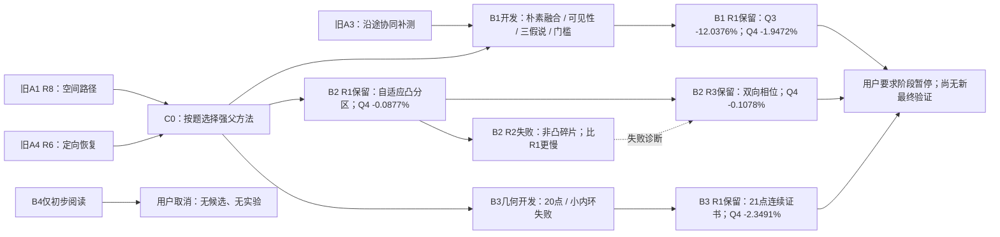

# 前三位研究者的优化路径：阶段暂停版

2026-09-11用户取消B4，先查看已有成果。B1停于R1，B2完成已启动的R3后暂停，B3停于R1；均不自动继续后续研究。B4只阅读，没有候选或实验。以下为可复查的设计依据、版本演变和实验决定。

共同起点为六条旧路线的43轮结果、文献和审计。C0按题采用A1 R8与A4 R6；4800案例全部已暴露。所有降幅相对同一C0，不代表新留出或官方结果。

|研究者|主要演变与当前证据|完整优化路径|结果报告|
|---|---|---|---|
|B1|朴素融合→可见性/假说/门槛对照→R1保留；Q3 -12.0376%，Q4 -1.9472%|[时间线与分支图](../B1/optimization_path.md)|[研究报告](../B1/report.md)|
|B2|R1自适应分区→R2碎片失败回退→R3双向相位保留；Q4 -0.1078%|[时间线与分支图](../B2/optimization_path.md)|[研究报告](../B2/report.md)|
|B3|20点及小内环反例→21点连续证书→R1保留；Q4 -2.3491%|[时间线与分支图](../B3/optimization_path.md)|[研究报告](../B3/report.md)|

每个路线节点都有实验前记录：时间、父版本/hash、问题、数据或文献依据、方案、预期、失败条件、修改模块及判定标准；实验后补实际候选身份、结果和负例、预算、保留/回退/取舍及下一步。未实施想法明确标记，失败不删除；机器可读JSON与各路径文件同目录。

完整比较、全部轮次身份与证据边界见[阶段总报告](STAGE_REPORT.md)和[候选登记](stage_registry.json)。原研究协议及最终验证预登记均已标记用户暂停，新样本没有生成。
