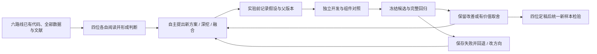

# 四位研究者的优化演变记录

本页是第二阶段研究路径的入口。候选尚在研究，不将设想写成已取得的效果。每位自行选择方向；这里记录其报告的阶段选择，不给四人预分算法路线。

## 共同起点

上一阶段六条路线、43轮正负结果、文献阅读与实现映射、组件消融、旧最终验证和独立审计均可共享阅读。两批共4800个案例从本阶段起属于已知研发数据。

强对照C0按题选择上一轮最佳：第三问A1 R8、第四问A4 R6。已实际复跑4800局，全部全清，与父方法15项任务字段逐项相同；它本身不计作新算法成果。记录见[对照核验](baseline/equivalence/audit.json)。

## 按研究者追踪

四位均已实际启动。各链接指向持续更新的本机研究记录；B1完成首轮后暂时让出并发位置给B4，稍后接续，未达到停止条件。最终报告会补精确提交版本的仓库链接。

|研究者|自主方向与当前证据|优化路径|初始计划|
|---|---|---|---|
|B1|机会补测与路径/可见性融合；R1的4800局全清，相对C0两题均值改善12.0376%/1.9472%；已保存，阶段暂停|[时间线与分支图](</Users/t/Documents/Codex/2026-09-10/new-chat/work/breakthrough/B1/experiments/B1/optimization_path.md>)|[计划](</Users/t/Documents/Codex/2026-09-10/new-chat/work/breakthrough/B1/experiments/B1/plan.md>)|
|B2|自适应凸分区光学覆盖；R1的4800局全清，Q3相同、Q4改善约0.08769%；R2研究失败clear后的非凸区域|[时间线与分支图](</Users/t/Documents/Codex/2026-09-10/new-chat/work/breakthrough/B2/experiments/B2/optimization_path.md>)|[计划](</Users/t/Documents/Codex/2026-09-10/new-chat/work/breakthrough/B2/experiments/B2/plan.md>)|
|B3|21个第四问搜索点；连续覆盖证书通过独立整数复核，任务耗时待完整实测|[时间线与分支图](</Users/t/Documents/Codex/2026-09-10/new-chat/work/breakthrough/B3/experiments/B3/optimization_path.md>)|[计划](</Users/t/Documents/Codex/2026-09-10/new-chat/work/breakthrough/B3/experiments/B3/plan.md>)|
|B4|已启动，自主阅读研究，不预设方向|记录建立中|计划建立中|

上述百分比都是已暴露研发集上的阶段结果，不能当作第二阶段的新样本验证。B1虽然48个分批场景均值均改善，Q3/Q4仍分别414/873局更慢，完整负结果保留在其优化路径与结果文件中。

## 每个节点记录什么

实验前：时间、问题与来源、父版本和散列、候选方案、预计作用、失败条件及接受标准。

实验后：实际代码快照、结果文件、数据角色与分母、时间和计算预算、退步/失败、保留/回退/取舍决定及下一步。将文献原结论、本题设计推断和实测效果分开。图中失败分支不删除，融合连线标注来源，未实测的想法明确标为待验证。

这里呈现的是可复查的设计依据、实验决策和版本演变。共同规则见[开放探索协议](PROTOCOL.md)，最终检验见[预登记计划](FINAL_VALIDATION_PLAN.md)。
