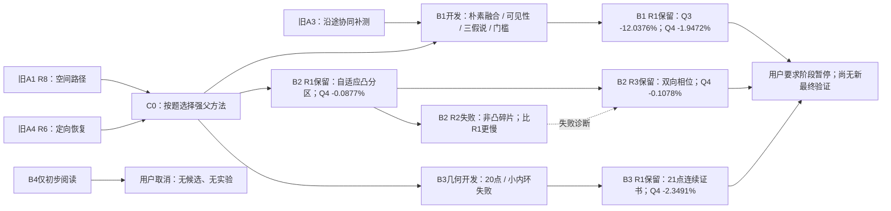

# 第二阶段重点突破：前三位研究者成果报告

截至2026年9月11日。**B4已取消；B1、B2、B3均已阶段暂停，无后续实验在运行。** B1完成1轮、B2完成3轮、B3完成1轮；本报告总结已经完成的5个冻结候选，不将用户要求的暂停写成研究收敛。本阶段没有生成新最终验证样本。

## 先看成果

最显著的新收益来自B1：在上一阶段各题最佳的强对照上加入沿途协同补测，Q3平均定位清除时间降低12.0376%，Q4降低1.9472%。B3重新设计第四问的连续覆盖结构，Q4降低2.3491%，是本阶段第四问均值最低的独立候选。B2提出有连续覆盖依据的自适应光学分区，但当前Q4收益仅0.1078%，应视为较小的局部改进。

以下均为本地已暴露研发回归，不是新样本或官方成绩。每个候选4800局：Q3、Q4各2400局，各含30970个源；三个保留候选均全部清除、正常退出、零异常。单位为每局“总虚拟耗时÷清除数”再取算术均值，秒/源。相对降幅按同批C0计算，未合成跨题加权总分。

强对照C0按已知题号选择旧A1 R8（Q3）和旧A4 R6（Q4），已实际复跑4800局并与父记录逐项核对；这种按题选择本身不算本阶段创新。C0合并Q3为271.054981、Q4为537.452219秒/源。

|保留候选|Q3秒/源|Q3降幅|Q4秒/源|Q4降幅|全清局|
|---|---|---|---|---|---|
|B1 R1|238.426471|12.0376%|526.986851|1.9472%|4800/4800|
|B2 R3|271.054981|0.0000%|536.872676|0.1078%|4800/4800|
|B3 R1|271.054981|0.0000%|524.827144|2.3491%|4800/4800|

两批单独看，v1对照为270.531505 / 534.426811，previous_final对照为271.578458 / 540.477626。每行每题1200局；previous_final从本轮起也属于已知研发数据。

|候选|批次|Q3秒/源|Q3降幅|Q4秒/源|Q4降幅|
|---|---|---|---|---|---|
|B1 R1|v1|237.932053|12.0501%|523.557967|2.0337%|
|B1 R1|previous_final|238.920888|12.0251%|530.415734|1.8617%|
|B2 R3|v1|270.531505|0.0000%|533.715144|0.1332%|
|B2 R3|previous_final|271.578458|0.0000%|540.030208|0.0828%|
|B3 R1|v1|270.531505|0.0000%|521.471319|2.4242%|
|B3 R1|previous_final|271.578458|0.0000%|528.182969|2.2748%|

## 三条路线分别改变了什么

### B1：已走到的位置，能否顺便为其他频道获取有用观测

**问题。** 原方法常在处理一个源时忽略其他已发现频道，之后又专门移动去测量它们。旧A3有沿途补测结构，但需要在更强的A1/A4父方法和合法混合源开发数据上重新验证。

**实现。** Q3保留A1的空间路线，Q4保留A4的定向恢复；每次已到达一个测点，估计其他已发现频道的定位不确定性可能减少多少。Q4还乘以可见概率，并用三个位置假说估计信息价值；达到门槛才真实付费measure。假想观测只用于排序，不能写入真实定位区域。补测有递归锁、总费用限制和共同时间切换。

**证据。** 新训练/开发各144个具体案例、七种配置均完整保存。开发Q4中，朴素融合566.9913秒/源，加入可见性门控560.4972；支持这一组件的条件性收益。三假说并不普遍更好：Q3反而更慢，Q4最终三假说只比单中心版本快0.0602秒/源，尚不足以证明它稳健。完整4800回归的48个分批场景均值均改善，但仍有1287个单局变慢。

### B2：把狭长定位区域分成能一次清除的小块

**问题。** 固定25米格点会在狭长区域附近布置冗余服务点，区域变小也不一定意味着实际路线变短。

**实现与演变。** R1沿示向度方向把可行多边形分带、分凸块，要求每块所有顶点距服务点小于20米，使整块都被一次clear覆盖。R2试图保留失败clear之后的非凸剩余碎片，几何上可靠，却增加碎片和服务点，实测变慢后退回R1。R3分别从左右两端生成两套完整覆盖，再依据完整路程或离散假说的首次命中成本选一套；失败clear只过滤排序假说，不破坏覆盖集合。

**证据。** 三轮分别开发336个新合法Q4案例，比较10个明确配置。R3开发从529.1211降到528.8571秒/源；完整暴露回归相对R1再减少0.1082秒/源，相对C0累计减少0.5795秒/源。改进很小；Q3完全沿用父行为，不能算作本轮新收益。

### B3：从覆盖条件本身重新设计第四问搜索站

**问题。** 旧22点三角剖分是保证方向覆盖的充分条件，但是否可以用更灵活的证书减少搜索站。

**实现。** 新点集为原点、8个999米内环点、12个1864米外环点，共21点。对每个小方格，找出距整个方格都不超过1000米的站点；只要方格处处落在这些站点的凸包内，任意过真实源的发射闭半平面都至少包含一个可接收站点。11200个四叉树叶方格共同覆盖目标区域，最终用整数运算核验实际坐标。

**证据。** 根协调另写了独立核验器，未导入作者验证器，连续证书通过；这不是仅检查格心或有限方向。9个20点构型及6个小内环21点构型失败，反例全部保存；只认证旋转0的999米结构，没有按暴露案例选择旋转。独立开发288个案例，C0与候选共实际运行576次，Q4由557.5798降至548.0195秒/源。完整4800回归Q4降2.3491%，但两批边缘最小半径场景都退步。

## 可回看的优化路径

图中保留失败分支和未实施想法；它描述设计依据、实验选择和版本演变。每个真实候选的快照及结果在后面的身份表中可直接打开。

|研究者|完整研究报告|实验前后路径记录|机器可读路径|
|---|---|---|---|
|B1|[报告](../B1/report.md)|[时间线与分支图](../B1/optimization_path.md)|[JSON](../B1/optimization_path.json)|
|B2|[报告](../B2/report.md)|[时间线与分支图](../B2/optimization_path.md)|[JSON](../B2/optimization_path.json)|
|B3|[报告](../B3/report.md)|[时间线与分支图](../B3/optimization_path.md)|[JSON](../B3/optimization_path.json)|

## 哪些文献真正进入了这轮实现

三位都读取了六条旧路线的报告、文献账本及程序化原始记录；程序解析全字节不等于逐动作人工复盘，更不等于重读所有论文。本轮明确重新阅读的是5篇论文的指定正文：B1一篇、B2三篇、B3一篇。其余继承阅读记录完整保留，不冒称本轮全文深读。

|文献与本轮实际阅读|采纳的原则|实现与本题结果|证据边界|
|---|---|---|---|
|[AIPPMS](https://arxiv.org/abs/2003.09746v1)，B1第1、3–5页|移动和感知都收费，应估计信息收益与成本|B1沿途补测和收益门控；完整R1两题改善，可见性组件有开发对照|没有复现POMCP/GCB，不继承次模保证；不能把整包收益全归给论文|
|[Environmental Sampling with the Boustrophedon Decomposition Algorithm](https://arxiv.org/abs/2207.06209)，B2第2–3页|先分区覆盖，再考虑进入方向|R1凸分块、R3左右相位；Q4微小改善|20米清除覆盖证明与贪心最小圆分区为本题自拟|
|[Set-Membership Localization via Range Measurements](https://arxiv.org/abs/2603.04867)，B2第3、7页|区分位置估计与包含真值的可靠集合|R2保守排除失败圆盘；几何正确但任务变慢|本题无距离测量，未复现SOCP/SDP；不能列作正向性能贡献|
|[Probabilistic Radio-Visual Active Sensing for Search and Tracking](https://arxiv.org/abs/2011.10474v2)，B2第3页|区分不同观测通道、合理处理未命中|R3仅排除被失败光学clear否定的离散假说，不以射频无信号否定源存在|没有实现完整贝叶斯滤波，收益只是此处相位选择的条件性证据|
|[A Closer Cut: Computing Near-Optimal Lawn Mowing Tours](https://arxiv.org/abs/2211.05891)，B3第3–5、7–8页|有限见证必须联系连续覆盖，不能只看离散采样率|21点站集与连续方格凸包证书；Q4回归改善|未实现CETSP/SOCP/割草算法；站集和方格引理为本题设计，不继承近优界|

分类主线：**任务代价→付费信息与协同测量（B1）；局部完整清除→几何分区与访问相位（B2）；全域定向发现→连续方向覆盖证书（B3）**。各论文在表中只列一次，文献原结果、借鉴原则和本题实测分开记录。逐篇页码、正文缓存身份和未读范围见三份literature.json及reading_coverage.json；没有新增SOTA或会议录用声明。

## 失败与退步必须一起看

下表“快/同/慢”按各题2400个配对局统计；最后一列分母为该题12场景×2批=24个场景均值。均值改善不保证每一局改善。

|候选|题|快/同/慢|最大单局退步秒/源|退步场景均值数/24|
|---|---|---|---|---|
|B1 R1|Q3|1986/0/414|+41.638037|0|
|B1 R1|Q4|1435/92/873|+190.397965|0|
|B2 R3|Q3|0/2400/0|+0.000000|0|
|B2 R3|Q4|946/1166/288|+72.266464|1|
|B3 R1|Q3|0/2400/0|+0.000000|0|
|B3 R1|Q4|1567/0/833|+301.669598|2|

具体退步场景：B2 R3在v1的偏心聚簇Q4增加0.562957秒/源；B3 R1在两批的边缘最小半径Q4分别增加6.359592、10.672245秒/源。B1虽无退步场景均值，最大Q4单局仍增加190.397965秒/源。B3最大Q4单局增加301.669598秒/源，不能用减少一个搜索站替代对尾部代价的检查。

B2 R2虽然仍优于C0的Q4均值，却比自己的R1更慢，按协议不刷新最佳。B1开发中的三假说也不是普遍有效。B4的初步想法没有代码或实测，不计入成果。所有单局案例ID、分批最差局与全场景数值保存在[独立逐局复算](audit/independent_stage_rows.json)及各路线原始结果中。

## 已完成的全部轮次与代码身份

所有5轮各有完整4800行评测，包括未保留的B2 R2；没有只存最佳。下表Q3/Q4都是合并已暴露批次均值。

|轮次|Q3秒/源|Q4秒/源|决定|源码|结果|代码提交|
|---|---|---|---|---|---|---|
|B1 R1|238.426471|526.986851|保留|[快照](../B1/snapshots/r1_solver.py)|[汇总](../B1/results/r1_exposed/summary.json)|`779cadbf85f0`|
|B2 R1|271.054981|536.980922|阶段改善，后被R3替代|[快照](../B2/snapshots/r1.py)|[汇总](../B2/results/r1_exposed/summary.json)|`6c5014e11991`|
|B2 R2|271.054981|537.220816|退回R1；保留负结果|[快照](../B2/snapshots/r2.py)|[汇总](../B2/results/r2_exposed/summary.json)|`253922d1148b`|
|B2 R3|271.054981|536.872676|保留|[快照](../B2/snapshots/r3.py)|[汇总](../B2/results/r3_exposed/summary.json)|`253922d1148b`|
|B3 R1|271.054981|524.827144|保留|[快照](../B3/snapshots/r1_solver.py)|[汇总](../../results/B3_r1_exposed/summary.json)|`4aab7c27c791`|

准确完整SHA256、代码提交、依赖散列、结果散列见[阶段候选登记](stage_registry.json)。B1、B3的保留快照自包含、仅标准库；B2 R3需要同目录parent_a1.py与parent_a4.py，两个依赖均已登记并保存。代码只调用enter/measure/clear/exit；本次审计没有重新运行候选。根solver.py、第一二问和冻结v1评测未修改。

## 已做的复核与尚未完成的验证

根协调逐轮核对4800个唯一ID、源数分母、正常退出、候选/依赖/缓存散列和78个汇总格；三个保留候选另由独立实现按原始行复算，均与报告一致。这是已有实验结果和身份审计，不是一次新的推理重跑。B1父源码结构核对、有限父行为等价测试与新增补测调用链检查均保存；B2覆盖构造和路由上界作源码/推导复查；B3另有独立整数连续覆盖核验。

各路线保留共同180000秒切换和有限完整覆盖，重新合成默认配置的保守虚拟上界：B1为283011秒，B2为281000秒，B3为281920秒，均低于360000秒。它们不是将两个父算法时间界直接相加。这些界依赖题面几何、误差界与合法动作接受；本地回归成功也不等价于官方模拟器一致。

本阶段**未进行新的最终留出验证，未执行Windows官方演练或正式测试**。此前新样本计划只完成预登记，现随用户要求暂停。未评测B1与B3进一步融合，也不能将各自降幅相加推算融合收益；虽然它们作用在不同模块，轨迹和观测会相互影响。

## 运行预算与保存位置

|研究者|冻结轮数|实际完整策略执行数|新训练/开发具体案例|说明|
|---|---:|---:|---:|---|
|B1|1|6960|288|训练1008次、开发1008次、父等价24次、quick120、full2400、旧final补跑2400|
|B2|3|18120|1008|开发3360次、三轮各quick120/full2400/旧final补跑2400|
|B3|1|5496|288|开发576次、quick120/full2400/旧final补跑2400|
|C0共同对照|1|4800|0|同一4800暴露案例实跑，并核对旧父结果|

上述合计35376次完整任务执行，重复运行不增加独立样本数。各候选都使用同一4800个暴露案例；quick属于full子集，旧结果读取和缓存复用不算新运行。规则检查、几何探查与证书核验单列，不能混入任务数。各执行阶段的真实计时详见B1/B2的execution_budget.json与B3的best.json；并行阶段耗时相加不能当作用户等待时间，历史C0现实耗时也不能用于声称当前机器运行加速。

本报告与三条分支的代码、原始逐局记录、失败结果、文献阅读账本和优化路径已汇入同一主仓库目录。上一阶段六条路线及43轮结果完整保留：[上一阶段总报告](../20260911_agent_campaign/REPORT.md)、[上一阶段文献映射](../20260911_agent_campaign/LITERATURE_MAP.md)。本轮保存状态以交付时的Git提交与远端核验为准；子路线早先的推送提示是当时状态，不代表最终汇总后的远端状态。

现有证据支持优先讨论B1的沿途协同和B3的连续覆盖结构；B2的分区方法可作为局部组件继续研究。以上仅是从当前阶段结果形成的判断，后续探索和新样本验证均等待用户决定。
