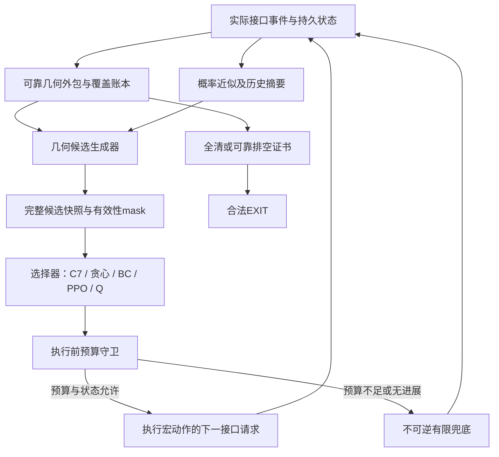

# CBG-PPO 方案核实与强化学习路线审阅稿

研究截止：2026年9月11日。版本：统一审阅稿v1；已完成两路提案实质修订与独立最终复评。两位研究者分别核验用户方案、扩展替代方法，第三位独立评议，协调者核读当前代码、指标与高影响来源。**本轮仅研究和修订方案，没有实现新算法、安装学习框架、训练网络或运行策略环境。** 是否进入工程与实验，由用户审阅后决定。

## 1. 建议：保留主线，先验证学习调度是否有用

用户方案最值得保留的是：**可靠几何约束提供动作基础，学习器选择跨频道任务，独立控制器负责完成与接管。** 但现有证据不足以把“3层 Graph Transformer + GRU + PPO + IDS相关机制”预定为最终模型。

建议下一步若获批准，先做共同底座与小规模对照：C7、C7等价包装、同候选非学习调度、行为克隆（BC）、轻量 PPO、行为支持约束 Q 学习。原C7单独保留；新包装内各选择器共享几何信息、候选执行器、完成守卫与数据划分。恒选C7能否等价原版，须先通过接口验收。只有学习选择器确有增益，再加图关系、GRU、信息价值或浅层规划。

两位研究者保留了有意义的分歧：A优先轻量PPO，理由是可以用当前策略的新轨迹直接优化；B优先C7示范加约束Q，理由是可以重用轨迹、学习长期服务价值。**评议没有选出算法性能胜者**；共同结论是应把这项分歧变成同条件实验，不能用异任务论文中的两个百分比定胜负。

现有强对照仍是C7：Q3为235.876945812秒/源，Q4为456.111820876秒/源；共同4800个暴露本地案例全部正常全清，两题各2400局、30970源。这些是[第四阶段的历史研发结果](../20260911_stage4/REPORT.md)，没有新增RL成绩，也不属于新的盲测或官方测试。训练目标中的跨局均值采用本项目[冻结研发协议](../../docs/评测标准_v1.md)，不冒充官方未公布的总分公式。

## 2. 用户草案的关键主张核对

|原主张|核实结论|本轮修订|
|---|---|---|
|IRIS 2026使用DQN、IDS、Pointer，说明价值法更适合信息探索|准确论文身份与2026年4月卷期已核实；本轮未取得可读正文，DQN/Pointer及具体论证尚未核实|保留准确引用和访问缺口，不把未读机制作为选型依据|
|RF实验PPO成功率80.1%、DQN76.3%|数字真实，但为Sionna环境、单静态发射源、多天线IQ观测；训练配置与折扣也不同|不能推成本题PPO优胜或干净的算法单变量比较|
|recurrent PPO“状态估计更稳定”|正文主要依据critic的explained variance；未直接验证本题几何belief误差|GRU降为需要单独检验的组件；原文goal特征的部署信息边界仍待解释|
|CAtNIPP与Dynamic Graph支持图候选决策|成立；CAtNIPP已组合attention、LSTM、Pointer与PPO|结构可借鉴，组合本身不能列为新贡献|
|AID-RL支持上述信息增益机制|准确“AID-RL”实体未确立；已找到的AID研究多机器人扩散意图和DPPO|不拿相似简称代替用户所指来源|
|DQN能给全部动作Q值，因此自然得到regret和information ratio|Q差和ensemble分歧可以构成启发式；它们不自动等于Bayesian regret或互信息|IDS必须另行定义潜变量、概率模型、信息目标和估计方法|
|方向楔形用±1°即可|漏掉示向度两位小数的舍入|可靠层按1.005°加数值余量，沿用已核代码的1.005001°口径|
|分别保存位置、半径、方向，或筛粒子即可构成可靠belief|联合相关性可能丢失；有限粒子筛空不能证明不存在|可靠外包与概率近似分层；证书不依赖采样是否为空|
|同址同频道检测全部mask|不会获得新的独立误差样本，但请求还承载移动、换频和通信重试语义|只移除经证明冗余的策略动作；不得阻断合法接管或同request_id重试|
|宏动作成本是四个开关相加|一次C7服务可能包含多个measure、clear、补测与near自动清除；clear也不换测向频道|按实际接受的接口事件逐项累计，宏动作采用真实总增量|
|600m网格可给Q4方向鲁棒发现保证|在闭180°发射半平面和最小1000m半径条件下，纸面几何成立|用作保守兜底证明；C7已有更紧的22站结构，不把49站替换当性能改进|
|只限制EXIT便能保证全部完成|只能防提前结束，无法阻止无限拖延或预算耗尽|加有限进展、不可逆接管、完整剩余费用和双时限条件|
|负时间奖励和成功子集均值足以优化题目|跨源数变化，E[T]不等于E[T/N]；只看成功子集可能奖励漏源|训练标签单位对齐；完整性先验收，保留所有失败，按冻结协议排名|
|百万级网络说明24GB Apple可训练且瓶颈在环境|本机容量已核实；指定Python尚无PyTorch/SB3等，未测CPU/MPS或吞吐|参数量不是资源证明；先实测再决定训练额度，不提供虚构小时数|

原文定位：[RF v1第IV、VI节](https://arxiv.org/html/2605.12569v1)、[CAtNIPP官方论文第4节](https://proceedings.mlr.press/v205/cao23b.html)、[Dynamic Graph](https://arxiv.org/abs/2402.04894)、[AID](https://arxiv.org/abs/2512.02535)、[IRIS出版记录](https://doi.org/10.1016/j.patcog.2025.112400)。IRIS准确题名为 *IRIS: An information path planning method based on reinforcement learning and information-directed sampling*，Ziyuan Liu等，*Pattern Recognition* 172:112400；DOI中含2025并不与2026卷期矛盾，元数据创建日期也不能充当首次在线发表日。

## 3. 文献支持哪些路线

主要近期范围为2024年至2026年9月11日，保留必要的早期结构和理论来源。A纳入29篇、B纳入21篇，合并9项交集后共41篇：14篇至少一位读取了指定关键正文，27篇为扩展记录。核心层表示确实读取了指定正文页节，**不表示每篇都逐页全文精读**；扩展层包含摘要、元数据及部分正文记录。下载全文也不等于读完。准确阅读范围、版本、发表状态、代码入口与访问失败均保留在[文献索引](LITERATURE_INDEX.md)及两位研究者的原始账本中。

|机制路线与代表来源|已读证据对本题的启发|不能据此断言什么|
|---|---|---|
|图注意力IPP：[CAtNIPP](https://proceedings.mlr.press/v205/cao23b.html)、[Dynamic Graph](https://arxiv.org/abs/2402.04894)|网络可对动态候选节点打分；图结构、候选生成、历史模块与奖励要分开控制|预算内信息收集不等于多频道全部清除；组合不是新架构证明|
|可迁移表示：[Towards Map-Agnostic Policies](https://arxiv.org/abs/2410.17166)、[Learning-based Methods for AIPP](https://arxiv.org/abs/2404.06940)|先比较可观测状态和表示，再比较优化算法|其他地图/观测模型的泛化不证明固定有界测角误差下的可靠性|
|离线候选价值：[OffRIPP](https://arxiv.org/abs/2409.16830)|C7轨迹可用于BC和受行为支持约束的Q学习；重放须保留原候选集合|表I未证明总能超过数据专家；其直接离线PPO对照不能替代正常on-policy PPO；门控公式与文字有不一致，不能照抄|
|部分可观测与记忆：[RESeL](https://arxiv.org/abs/2405.15384)、[RF active sensing](https://arxiv.org/abs/2605.12569)|循环训练稳定性、序列采样和上下文编码器优化值得检查|“部分可观测必选PPO”与“GRU必有效”均无此依据|
|信息引导：[C-IDS](https://arxiv.org/abs/2602.03939)、[Information-Directed Offline-to-Online RL](https://arxiv.org/abs/2605.29405)|IDS可有策略梯度形式；应区分精确信息量和深度ensemble代理|线性Gaussian或指定context条件下的理论不能迁移到本题；C-IDS个别证明条件本轮未核通过，故不采用其保证|
|已知模型短规划、学习叶价值：[TD-MPC2](https://arxiv.org/abs/2310.16828)、[DreamerV3](https://arxiv.org/abs/2301.04104)、[DyPNIPP](https://arxiv.org/abs/2410.17186)|本题移动和计费已知，先研究浅层观测分支和剩余费用，可能比重学物理更直接|完整世界模型的跨任务结果不能证明本题有收益；观测边界和固定误差场不能随意平滑或重抽|
|复杂动作生成：[Flow Q-Learning](https://arxiv.org/abs/2502.02538)、[AID](https://arxiv.org/abs/2512.02535)|若以后连续落点或多机器人意图确成瓶颈，可借多峰生成与BC后优化|当前有限候选、单机器狗阶段没有充分理由先加flow/diffusion|
|安全和动作限制：[Shielding](https://arxiv.org/abs/1708.08611)、[Invalid Action Masking](https://arxiv.org/abs/2006.14171)|明确分工：合法动作限制、提前退出证书、有限进展和时限责任|mask不自动推出完成性；经验100%成功不等于最坏情况定理|

分类按主机制去重；跨类关系用标签表示。2026年9月的候选也已进入扩展筛查，但仅有摘要/元数据的记录不会因此压过已读且更贴近任务的来源。本轮没有可比协议下的跨论文SOTA排名，也没有完成足以宣称首创的全面新颖性检索。

## 4. 修订后的共同架构

### 4.1 两种belief职责不同

学习器要解决的是任务先后次序。例如，同一时刻可以去清除已定位频道A、顺路搜索未知频道B，或为频道C再测一个角度。几何算法给出可执行选项与当前费用，学习器的待验证价值在于判断这些选择对后续路线和服务的总影响；它不必控制每一米移动。这是说明性例子，不是已观察到的RL增益。

可靠层保存与真实观测一致的活源假设的保守外包，包括位置、半径、类型和方向的必要联合约束。`no_signal`在Q4只能排除本应可接收的联合假设，不能无条件挖掉周围1000m圆。可靠活源集合为空且无源假设仍与观测一致，才可能判定空频道；“所有假设都矛盾”是模型/数值异常，不能当无源。

概率层用于预测发现概率、清除概率、期望费用和信息代理；模型分布是本地假设。有限粒子坍缩只触发修复，不修改可靠证书。按频道拆分存储也不等于概率独立：总数10–16与可能共享误差场会形成跨频道关联。

位置与方向相关性是实质问题。例如源可能在测点左侧且向右，或右侧且向左，两种都可接收；改成左侧向左、右侧向右则都不可接收。两组的位置和方向边际完全相同，但接收概率相反。这是评议者构造的纸面反例，不是训练结果。

面积、中心、半径和几个熵值不能还原完整历史，不能直接宣称Markov。GRU可作为压缩损失的补偿假设，是否值得由消融决定。`localized`只是调度标签；要保证一次clear成功，需可靠位置集合可包含于半径≤20m的圆，单说直径≤40m不够。

### 4.2 C7候选必须保留真正的执行语义

首版在C7自然调度边界选择宏动作；一次源服务可能包含多个付费请求。候选身份必须包含所属频道、服务类型、目标、路线后继点、局部进度/状态版本与停止条件。当前`spatial_next_task`会修改`route_successor`，后者影响清除落点，因此只有`source + channel`不能重放相同动作。

候选生成在独立快照上计算，执行时只提交选中payload。首个工程门槛是恒选C7候选时，原请求轨迹、状态转移和费用等价。保留合法的启发式clear尝试；失败清除是有费用的合法信息，不应被一律屏蔽。初始K≤64只是一项待测配置，在允许区域与预算合同内保留C7和兜底选项。若硬限制改变C7动作或触发接管，须记为包装改变，不能无条件声称仍包含原C7全部动作。

PPO保存采样时的候选、mask、实际动作身份和旧logprob；Q保存当时及下一状态的完整候选快照。更新时重新生成候选再套旧动作序号，会改变概率比率或Q目标。模型、归一化、候选和GRU输入均不得含真实源数、位置、类型、seed、场景ID或训练特权奖励。

### 4.3 完成性要有可计算的后备方案

EXIT只在20个频道均已清除/可靠排空，或已经收到16个不同频道的clear success后开放。网络不能改写该证书；禁止早退之外，还要保证剩余义务能在有限预算内执行完。

日常仍可用C7已有7/22站结构。为使学习策略任意排序后仍有独立证明责任，两位提案保留以下更保守的纸面兜底：600m间隔的49站覆盖目标圆外接正方形，每站检查尚未处理频道。任意源所在网格的四顶点都在1000m内，而任意过源的闭半平面至少包含其中一点，故可发现任意方向源。

发现后，返回测角及舍入给出相对局部坐标矩形：纵向0–1500m，横向约±26.32m。76×4个光学格点、20m间距可覆盖它，每一点到最近格点≤10√2<20m；因此单源至多304次clear即可清除。near则可同址清除。返回覆盖站的移动通过下一次合法请求真实计费，不能引入免费move。

两路线修订后采用共同合同：若学习阶段每次请求端点限制于[-4000,4000]²，最坏980次measure、16×304次clear，加路线长度上界，可得：

\[
B_V\le \frac{5800\sqrt2+28800}{5}+980\cdot6+16\left(\frac{7591}{5}+304\cdot3+2\right)<53000\text{秒}.
\]

这是**题设理想响应下的纸面虚拟时间上界**，尚未实现或验收。宏动作须能在单次接口边界中断；执行前检查`已用时间 + 下一请求上界 + 53000 + 裕量 < 360000`，学习阶段单次请求上界取2300秒，在累计虚拟耗时达到300000秒前停止放行新的学习请求，因此保守总界300000+2300+53000=355300<360000秒；共同补充上限为10000个学习阶段已接受请求、连续32次调度决策无有效进展即接管；进展由观测、可靠几何、覆盖或清除账本判定。触发后不可逆进入兜底，不再次enter，不重置真实位置、清除记录或截止时间。兜底使用自己的合法区域，不能被学习阶段box限制阻断。

现实期限是enter后1200秒与25分钟窗口中较早者。至多5844次measure/clear再加EXIT，只有通信、本地计算与重试具有足够的确定上界，才可声明现实期限内完成。P99或历史最大值都不是数学上界。当前没有官方通信上界验证，所以不承诺无条件“永不漏源”；可审阅的是几何保证、有限预算构造与明确的现实条件。

## 5. 奖励与评价必须对齐

全清后，第i局指标为T_i/N_i；本地跨局采用其算术均值。两个同权案例N=10/16：方案A总时间1000/1600，平均总时间1300、每源100；方案B为1100/1450，平均总时间1275更低、每源100.3125反而更高。这个纸面反例说明只优化E[T]可能选错本项目指标下的方案。

拟采用完整episode均匀加权、训练器回填：

\[
r_t^N=-\frac{\Delta T_t}{T_0N_i},\qquad \gamma=1,\qquad G_t^N=-\frac{T_i-T_{i,t}}{T_0N_i}.
\]

固定T0=1000秒。真实失败在终端额外记一次−100无量纲训练信号；PPO与Q共用，不能把它解释为词典序的等价数学实现。N只用于训练回报与评测，不进入部署输入，尤其不能通过GRU的previous reward泄露。已经除N的回报不能再按1/N重复加权。PPO和Q使用相同单位；完整历史上的Q目标可定义为条件期望剩余归一化费用，实际压缩状态仍存在混叠误差，不能因此宣称精确Bellman状态或学习收敛。

首版PPO用完整episode的Monte Carlo回报，只对学习选择器实际抽样决策求梯度；兜底尾段费用进入回报，确定性兜底动作不伪造PPO采样概率。第一版关闭信息shaping。以后若采用有界势差且所有真正终端Φ=0，在γ=1下整局势差和只剩与动作无关的初始常数；这是望远镜求和，不是训练必然加速的证明。固定γ<1按宏动作数折扣、或按物理时长折扣，都会改变原始未折扣时间目标。

转入兜底仍属于同一episode，必须计入后续费用。真实deadline/异常失败是终端并单独标失败；人为暂停采样才可考虑bootstrap，不能把真实超时变成便宜截断。有限失败罚分也不自动等价于“成功概率优先”的词典序优化。因此训练损失、硬约束和最终验收分别说明：任何候选未过完整性门槛，不给所在场景做成功子集耗时冠军排名。

## 6. 建议后续阶段与预算门槛

本节全部为待批准计划。共同原则是先证明包装和数据有意义，再申请训练规模；不直接收集10万至100万条示范，不依据论文GPU小时数估计本机工期。

|阶段|最先回答的问题|完成或停止条件|
|---|---|---|
|G0 接续、费用与证书|恒选teacher能否等价C7？候选副作用、near自动clear、请求重试、接管状态和预算是否正确？|任一接口语义或证书错误，先修底座，不训练|
|G1 资源与示范诊断|候选构造、几何、CPU/MPS前后向、采集及存储分别花多少？BC学到C7还是只会固定排序？|有实测batch=1完整决策P95/P99、峰值内存、原始请求量与完整局数，才能定后续额度|
|G2 同条件学习竞争|同候选下BC、轻量PPO与行为支持约束Q能否改善C7？|至少3个训练初始化；相同新增交互额度和选择场景；完整性全部过关后才比较配对耗时|
|G3 一次只改一项|收益来自图关系、记忆、信息代理还是候选生成？浅层规划是否有额外价值？|只加入有明确失败模式/假设的模块；收益必须覆盖推理和训练成本|
|G4 冻结与最终验证|在未暴露场景和官方接口上是否仍有效？|先冻结代码、权重、候选、阈值、依赖，再生成最终样本；旧4800局只作暴露回归|

B路线必须特别防止“支持约束使Q退化成BC”：纯C7轨迹通常只记录一个实际动作，不能凭空得知同状态下其他动作的反事实收益。强行保留C7动作只保证可选，不保证Q估值可靠。需要分别报告支持外提议比例、实际探索、BC与Q的差值；离线Q不足以改进时不能把BC接近C7宣传成RL成果。

两路线按真实episode、primitive接口交互、总墙钟与数据获取成本对齐，不能只给相同梯度步数便称公平。PPO微调使用当前策略采样轨迹，不能把旧离线示范直接套PPO比率。浅层规划也使用同候选与可观测输入；一次模拟中固定源假设和误差场，不能每条搜索边重新抽噪声。

新训练、课程、checkpoint选择、暴露回归、最终验证分别登记。1/4/8源和全定向可用于课程或压力，正式Q3/Q4保持10–16源，Q4每局同时存在全向与定向。按布局与误差场分区防止重叠；训练初始化与环境种子分别记录。最终集若被用于修订，就不再称原有盲测。

建议将以下数值作为逐阶段上限，而非立即启动的整批计划：

- G0：最多80个小型接口/几何检查场景及40个完整局；G1：最多24局且不超过10万次实际接口请求，以先到者为准。
- G2示范：共享512局全新C7轨迹。Q与PPO各3个训练初始化，每个初始化最多1024个新增训练局或100万次实际接口请求，以先到者为准。BC是单独基线，不能被Q改进冒名。
- 选择集：192个全新隔离场景，每个算法/初始化最多评估4个预定checkpoint；选择评测的接口数和墙钟另记，不能隐藏在训练额度外而不报告。
- 晋级建议：所有部署评估完整性通过；针对声称改进的题，相对原C7和BC的配对平均每源耗时至少改善2%，95%配对差区间上界<0，且至少2/3初始化方向改善。Q3/Q4分别晋级，未通过的题继续保留C7，不能合成总体胜利。2%是待审阅的研发意义门槛，并非理论要求或官方分数；只能在查看选择结果前确定，不能事后迁就结果。

这些额度没有执行，也没有本机小时数保证。G1实测不支持时应减小或停止后续阶段；训练更新数、数据获得成本和部署耗时仍需同时记录。

## 7. 交叉评议与保留问题

两位分别提交初稿后，C给出A1–A6与B1–B6正式反馈；A形成R2、B形成R1，再经C全文复核。核心改动不是措辞调整：

|评议发现|实际修订|仍需未来验证|
|---|---|---|
|原奖励只闭合总时间，Q目标仍留“后续检查”|两路线固定相同每源单位、终局N标签；A写完整MC PPO权重，B写同单位MC/TD与三步符号核对|压缩状态、函数逼近和离线支持偏差|
|接管和真实超时的terminal含混|确定失败终端、一次失败信号、人工暂停边界；fallback尾费用折叠时指向实际终端，不重复计费或bootstrap|实现中的事件/回放边界|
|含absent的联合集合被笼统称为空|区分活源空集、无源仍可行与整体数据矛盾|数值外包与异常恢复|
|只禁EXIT或引用旧策略上界|补独立49站/304格构造、共同box/费用/单向接管合同|实际代码满足合同、官方现实期限|
|候选身份不含C7副作用及路线后继|固定完整payload、快照和生成版本；原C7独立对照|恒选teacher的请求与成本等价|
|复杂度、示范规模、比较条件不具体|先轻量表示，同阶段PPO/Q；固定共享示范与新增交互上限、按题晋级|真实资源成本、重复初始化和未暴露验证|
|论文数字与方法身份被扩大解释|RF数值和解释分开；IRIS元数据和未读机制分开；AID-RL不以相似论文代替|缺失正文或准确来源；投稿前的新颖性检索|

最终复评对象的版本与SHA256以[C最终评议](C_review/REVIEW_FINAL.md)为准；完整逐项回应见[A修订记录](A_user_method/revision_log.md)、[B修订记录](B_frontier/revision_log.md)。本轮“收敛”只表示方案质量已足够供用户审阅，不表示性能、最优性或实施已获认可。

仍必须由未来实验回答：学习调度能否胜C7；离线支持约束是否限制创新动作；GRU是否有净收益；候选构建是否占主要时间；CPU/MPS是否可用且划算；近似观测模型是否足够；官方通信能否满足现实期限。IRIS正文机制与“AID-RL”准确身份仍保留来源缺口。论文贡献、新颖性、性能与训练收敛均未在本轮证实。

审阅建议是先决定是否开展G0–G2；完整Graph-Recurrent-PPO、IDS、生成式模型、长训练与替换C7，均以先行证据为条件。

## 8. 可追溯材料

- [A：用户方案核验与PPO路线](A_user_method/PROPOSAL.md)
- [B：前沿替代、约束Q与浅层规划](B_frontier/PROPOSAL.md)
- [C：第一轮正式评议](C_review/REVIEW_R1.md)与[最终复评](C_review/REVIEW_FINAL.md)
- [去重原文与阅读范围索引](LITERATURE_INDEX.md)、[机器可读合并语料](literature_merged.json)、[机制分类树](TAXONOMY.md)
- [协调者：当前代码、计费与软件核读](COORDINATOR_FINDINGS.md)

研究语料缓存与论文全文不进入提交材料；交付保留准确来源链接、短证据定位和原创分析。
