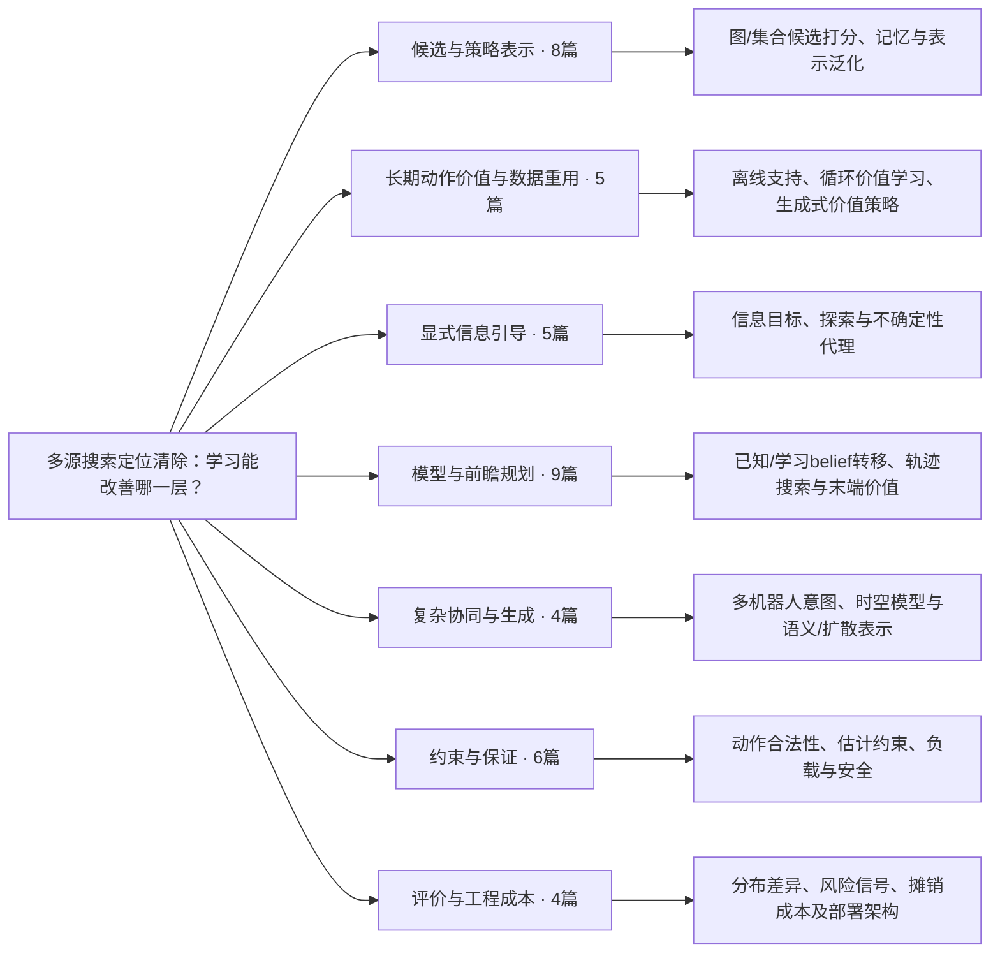

# 机制分类树：本题强化学习候选路线

这是一棵协调者为比较方案而构建的主机制树，不是论文官方分类。每篇只在一个主分支计数；跨类标签和两位研究者原始分类保留在合并JSON。未读正文的扩展记录只定位研究方向，不据此认可机制细节或证明。

## 主机制 → 方法问题 → 原文

### 候选与策略表示（8篇）

图/集合候选打分、记忆与表示泛化。

- [L01 · Active Sensing with Meta-Reinforcement Learning for Emitter Localization from RF Observations](https://arxiv.org/abs/2605.12569) — 关键正文。
- [L04 · CAtNIPP: Context-Aware Attention-based Network for Informative Path Planning](https://proceedings.mlr.press/v205/cao23b.html) — 关键正文。
- [L05 · Deep Reinforcement Learning with Dynamic Graphs for Adaptive Informative Path Planning](https://arxiv.org/abs/2402.04894) — 关键正文。
- [L10 · Learning-based Methods for Adaptive Informative Path Planning](https://arxiv.org/abs/2404.06940) — 关键正文。
- [L14 · Towards Map-Agnostic Policies for Adaptive Informative Path Planning](https://arxiv.org/abs/2410.17166) — 关键正文。
- [L20 · Attention-based Learning for 3D Informative Path Planning](https://arxiv.org/abs/2506.08434) — 扩展记录。
- [L28 · HyCO: A Hybrid Neural Solver for Combinatorial Optimization](https://arxiv.org/abs/2609.07990) — 扩展记录。
- [L33 · LASER: Learning Active Sensing for Continuum Field Reconstruction](https://arxiv.org/abs/2604.19355) — 扩展记录。

### 长期动作价值与数据重用（5篇）

离线支持、循环价值学习、生成式价值策略。

- [L07 · Efficient Recurrent Off-Policy RL Requires a Context-Encoder-Specific Learning Rate](https://arxiv.org/abs/2405.15384) — 关键正文。
- [L08 · Flow Q-Learning](https://arxiv.org/abs/2502.02538) — 关键正文。
- [L12 · OffRIPP: Offline RL-based Informative Path Planning](https://arxiv.org/abs/2409.16830) — 关键正文。
- [L16 · A Covering Framework for Offline POMDPs Learning using Belief Space Metric](https://arxiv.org/abs/2603.03191) — 扩展记录。
- [L26 · Fast and Highly Expressive Policy Learning for Offline Reinforcement Learning via Bootstrapped Flow Q-Learning](https://arxiv.org/abs/2606.10613) — 扩展记录。

### 显式信息引导（5篇）

信息目标、探索与不确定性代理。

- [L03 · C-IDS: Solving Contextual POMDP via Information-Directed Objective](https://arxiv.org/abs/2602.03939) — 关键正文。
- [L09 · Information-Directed Offline-to-Online Reinforcement Learning](https://arxiv.org/abs/2605.29405) — 关键正文。
- [L21 · CIG-RL: Curiosity-Driven Information-Guided Reinforcement Learning for Source Term Estimation in Uncertain Environments](https://arxiv.org/abs/2608.30673) — 扩展记录。
- [L25 · Expected Free Energy-based Informative Path Planning for Robotic Mars Exploration](https://arxiv.org/abs/2608.14466) — 扩展记录。
- [L32 · IRIS: An information path planning method based on reinforcement learning and information-directed sampling](https://doi.org/10.1016/j.patcog.2025.112400) — 扩展记录。

### 模型与前瞻规划（9篇）

已知/学习belief转移、轨迹搜索与末端价值。

- [L06 · DyPNIPP: Predicting Environment Dynamics for RL-based Robust Informative Path Planning](https://arxiv.org/abs/2410.17186) — 关键正文。
- [L11 · Mastering Diverse Domains through World Models](https://arxiv.org/abs/2301.04104) — 关键正文。
- [L13 · TD-MPC2: Scalable, Robust World Models for Continuous Control](https://arxiv.org/abs/2310.16828) — 关键正文。
- [L19 · Approximate Sequential Optimization for Informative Path Planning](https://arxiv.org/abs/2402.08841) — 扩展记录。
- [L23 · Dream-MPC: Gradient-Based Model Predictive Control with Latent Imagination](https://arxiv.org/abs/2605.04568) — 扩展记录。
- [L24 · Efficient Localization of Directional Emitters via Joint Beampattern Estimation](https://arxiv.org/abs/2411.04364) — 扩展记录。
- [L27 · Hierarchical Informative Path Planning via Graph Guidance and Trajectory Optimization](https://arxiv.org/abs/2601.17227) — 扩展记录。
- [L29 · IA-TIGRIS: An Incremental and Adaptive Sampling-Based Planner for Online Informative Path Planning](https://arxiv.org/abs/2502.15961) — 扩展记录。
- [L41 · Trajectory Optimization for Adaptive Informative Path Planning with Multimodal Sensing](https://arxiv.org/abs/2404.18374) — 扩展记录。

### 复杂协同与生成（4篇）

多机器人意图、时空模型与语义/扩散表示。

- [L02 · AID: Agent Intent from Diffusion for Multi-Agent Informative Path Planning](https://arxiv.org/abs/2512.02535) — 关键正文。
- [L22 · DIFF-IPPO: Diffusion-Based Informative Path Planning with Open-Vocabulary Belief Maps](https://arxiv.org/abs/2606.16780) — 扩展记录。
- [L36 · Multi-robot Learning-based Informative Path Planning Using Spatio-Temporal Gaussian Process Kalman Filter](https://arxiv.org/abs/2609.05515) — 扩展记录。
- [L40 · Scalable Multi-Robot Informative Path Planning for Target Mapping via Deep Reinforcement Learning](https://arxiv.org/abs/2409.16967) — 扩展记录。

### 约束与保证（6篇）

动作合法性、估计约束、负载与安全。

- [L15 · A Closer Look at Invalid Action Masking in Policy Gradient Algorithms](https://arxiv.org/abs/2006.14171) — 扩展记录。
- [L30 · Information-Guided Safe Reinforcement Learning for Autonomous Gas Source Localization using sUAS](https://arxiv.org/abs/2609.05569) — 扩展记录。
- [L31 · Informative Path Planning with Guaranteed Estimation Uncertainty](https://arxiv.org/abs/2602.05198) — 扩展记录。
- [L35 · LIPP: Load-Aware Informative Path Planning with Physical Sampling](https://arxiv.org/abs/2603.06924) — 扩展记录。
- [L37 · N(CO)$^2$: Neural Combinatorial Optimization with Chance Constraints to Solve Stochastic Orienteering](https://arxiv.org/abs/2606.18514) — 扩展记录。
- [L39 · Safe Reinforcement Learning via Shielding](https://arxiv.org/abs/1708.08611) — 扩展记录。

### 评价与工程成本（4篇）

分布差异、风险信号、摊销成本及部署架构。

- [L17 · A Unified Experimental Architecture for Informative Path Planning: from Simulation to Deployment with GuadalPlanner](https://arxiv.org/abs/2602.10702) — 扩展记录。
- [L18 · An Amortized Efficiency Threshold for Comparing Neural and Heuristic Solvers in Combinatorial Optimization](https://arxiv.org/abs/2605.14624) — 扩展记录。
- [L34 · Learning from World Feedback: Why Model Uncertainty Fails as a Risk Signal in Model-Based RL](https://arxiv.org/abs/2607.16591) — 扩展记录。
- [L38 · On Distributional Dependent Performance of Classical and Neural Routing Solvers](https://arxiv.org/abs/2508.02510) — 扩展记录。

## 本轮选型如何使用这棵树

先固定可靠集合、候选和完成守卫，再比较P分支轻量PPO与Q分支受支持约束Q。I分支的信息比率需要独立概率定义；M分支优先已知物理浅规划；C分支的多机器人和扩散模型暂缺当前单机器狗任务必要性。S分支不能代替本题有限完成证明，E分支用于制定成本和数据协议。

原C7独立保留；新包装内各选择器共享底座。只有包装等价验收通过，才可把相同候选下的选择器差异归因于学习。41篇的存在不证明这项组合新颖，也不证明它能提高成绩。
