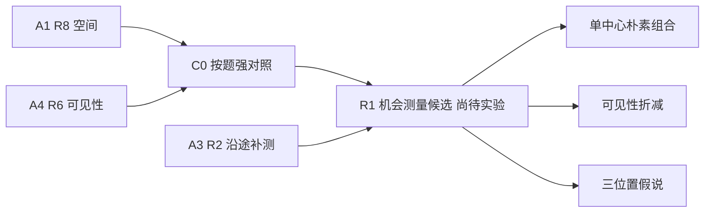
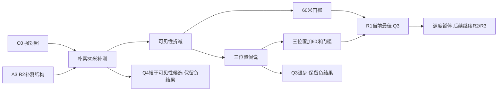

> 2026-09-11阶段状态更新：用户取消B4并要求先查看已有成果。本路线停于R1，后续轮次与新最终验证均暂停；下文调度接续安排为早先记录，未经用户重新决定不自动恢复。

# B1 优化时间线

## R1 · 实验前

父版本：C0（Q3 A1 R8；Q4 A4 R6）与A3 R2机会补测。证据为旧原始行全量汇总和AIPPMS原文第1、3–5页。

问题：移动和额外检测的收益相互作用尚未在强父版本上检验。方案：保留父定位/覆盖，加入有预算上限的补测；比较单中心、可见性折减、三个位置假说。尚未获得实验结果。

计划与判定见[plan.md](plan.md)，冻结开发代码见[snapshots/r1_development.py](snapshots/r1_development.py)。

## R1 · 开发后冻结

训练和开发共2016/2016局全清。独立开发Q3：C0 286.4731、朴素30米门槛251.5779、60米门槛250.8742；Q4：C0 574.0640、朴素566.9913、可见性560.4972、三假说60米门槛560.3975。据开发均值选Q3 visibility60、Q4 quadrature60，保留其余完整负结果；Q4三假说相对visibility60仅快0.0602秒/源，不能夸大稳健性。

[训练全部结果](results/r1_train/summary.json) · [开发全部结果](results/r1_development/summary.json) · [冻结R1](snapshots/r1_solver.py)。关闭补测的命名空间重构在24个平衡合法任务上与精确C0全部任务字段相同，见[parent_equivalence](results/r1_parent_equivalence.json)。冻结后才开始规则、quick、full与4800暴露复核。

## R1 · 完整4800局后

采用R1。两批四个分题均值均改善，48个分批分题场景均值无退步，但Q3有414局、Q4有873局变慢。完整证据：[4800比较](results/r1_exposed/summary.json)、[全部单局退步](results/r1_case_regressions.json)、[最差局](results/r1_worst_cases.json)。SHA `ba417e4ac97d9d7ce04f7b6c0831f3c38bc70f81e4c0f313f1ebb60663dfab98`，代码提交 `779cadbf85f02723f05f797dce3d8f9e89729f8e`。

冻结前开发选择与冻结后完整回归分别记账：本轮6960次完整任务，含576次开发父对照、24次命名空间等价重放。14规则和79正常规则另计。主协调后续的新最终样本尚未生成，本路线不接触其调参。

## 图节点的真实工件索引

每个图节点都对应以下可复查工件；开发候选共享同一冻结开发源码，由所列配置区别，不把配置节点冒称新的独立代码版本。Reject节点是对应父节点的负结果判断，没有另造未运行源码。

|节点|源码或父记录|完整结果/具体配置|
|---|---|---|
|A1|[A1 R8](../20260911_agent_campaign/final_candidates/A1_space_R8.py)|[上一阶段完整结果](../20260911_agent_campaign/final_validation/A1_space_R8/summary.json)|
|A4|[A4 R6](../20260911_agent_campaign/final_candidates/A4_directional_R6.py)|[上一阶段完整结果](../20260911_agent_campaign/final_validation/A4_directional_R6/summary.json)|
|C0|[C0](../20260911_breakthrough/baseline/C0.py)|[真实开发C0行](results/r1_development/C0_rows.json)|
|A3|[A3 R2](../20260911_agent_campaign/final_candidates/A3_coordination_R2.py)|[真实开发A3行](results/r1_development/A3_R2_rows.json)|
|N/RejectN|[开发源码](snapshots/r1_development.py)|[naive完整行](results/r1_development/naive_rows.json)，style=naive，gain=30|
|V|[开发源码](snapshots/r1_development.py)|[visibility完整行](results/r1_development/visibility_rows.json)，style=visibility，gain=30|
|Q/RejectQ|[开发源码](snapshots/r1_development.py)|[quadrature完整行](results/r1_development/quadrature_rows.json)，style=quadrature，gain=30|
|V60|[开发源码](snapshots/r1_development.py)|[visibility60完整行](results/r1_development/visibility60_rows.json)，style=visibility，gain=60|
|Q60|[开发源码](snapshots/r1_development.py)|[quadrature60完整行](results/r1_development/quadrature60_rows.json)，style=quadrature，gain=60|
|R1/Best|[冻结R1](snapshots/r1_solver.py)|[4800完整行](results/r1_exposed/case_metrics.json)|
|Pause|[阶段接续](resume.md)|不是实验候选；调度状态待恢复|
