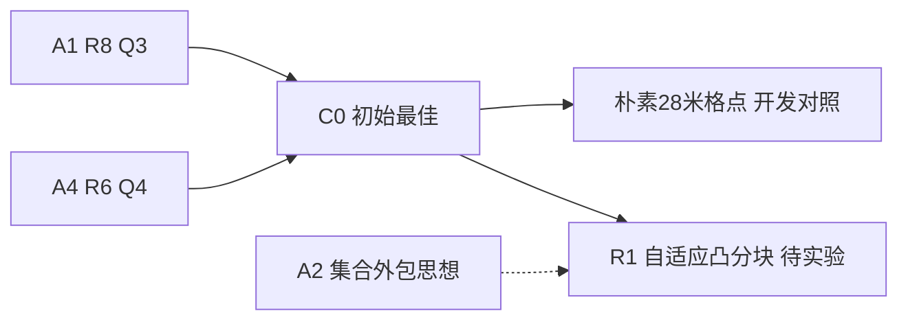

# B2 优化路径

## 时间线

- **2026-09-11，R1实验前**：读取六路线报告、源码差异、43轮全量原始行、训练/开发记录。观察到固定光学方格覆盖尚未直接优化。计划以A4 R6为Q4执行父方法，用20米圆认证的自适应凸分块减少停点；Q3精确保留A1 R8。先比较父方法、朴素28米格点、自适应分块三种开发变体，风险与接受规则见[plan.md](plan.md)。尚无性能结论。

源/结果链接：[父A1](../20260911_breakthrough/baseline/A1_space_R8.py)、[父A4](../20260911_breakthrough/baseline/A4_directional_R6.py)、[旧轮复算](research/prior_rounds_recomputed.json)。候选冻结与结果产生后追加真实链接，不删除失败分支。

- **R1实验后**：R1在4800局全部全清且正常退出，Q3逐局保持C0；Q4两批均改善，combined降低0.471296秒/源（0.08769%），按协议刷新B2最佳。仍有389局更慢，收益很小。 候选[r1](snapshots/r1.py)；[完整结果](results/r1_exposed/summary.json)、[单局退步](results/r1_regressions.json)。决策：accepted。

- **R2实验前**：R1还有389局更慢；检验失败clear后保留非凸剩余区域。开发比较R1、仅安全删点、内接12边形排除后的凸碎片分区，关注碎片膨胀的负作用。依据与判定详见JSON事件R2_design。

- **R2开发后/冻结前**：三个方案各336局全清；安全删点与R1完全相同，凸碎片法增加0.447569秒/源。冻结碎片法[r2.py](snapshots/r2.py)完成两批负结果验证；不把无改动父法冒充创新。

- **R3实验前**：R2开发出现碎片膨胀，完整回归尚在运行。另从R1研究双向分区相位：左右起分区均覆盖全域，用完整路程或概率首次命中成本选择；失败clear只更新权重。四个对照预登记。

- **R2实验后**：R2全部4800局全清，但Q4 combined为537.220816363，比R1慢0.239894294秒/源；两批均比R1慢。非凸区域保留正确，凸碎片覆盖增加停点与失败尝试，保留负结果并回退R1。 候选[r2](snapshots/r2.py)；[完整结果](results/r2_exposed/summary.json)、[单局退步](results/r2_regressions.json)。决策：rejected。

- **R3开发后/冻结前**：1344次全清，四对照Q4为529.121106/528.972787/528.932009/528.857104秒每源。选择失败修正权重的双向相位方案[r3.py](snapshots/r3.py)，开发比R1快0.264002秒每源，尚不当作新样本证明。

- **R3实验后**：R3在4800局全部全清且正常退出，Q3逐局保持C0；Q4两批均优于R1，combined为536.872676238，较R1减少0.108245831秒/源，较C0减少0.579542318秒/源（0.107831%）。按协议刷新最佳并进入延长；仍288局比C0更慢，收益很小。 候选[r3](snapshots/r3.py)；[完整结果](results/r3_exposed/summary.json)、[单局退步](results/r3_regressions.json)。决策：accepted。
