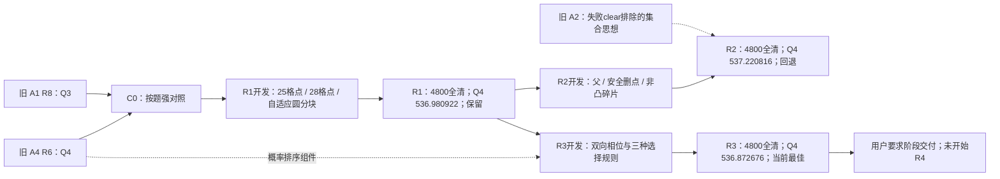

# B2 显式优化路径：阶段暂停

每一项实验前的假设、证据、修改范围和判定标准已按时间写入[JSON账本](optimization_path.json)。实验后追加，不覆盖失败假设。以下是便于阅读的摘要。

## R1_design

时间：2026-09-11T01:56:18.326988+00:00。
- 已观察问题：固定光学网格的停点冗余
- 计划方案：用20米圆认证的自适应凸分块代替25米格点，保持完整区域覆盖
- 可检验预期：减少清除尝试和移动；Q3保持精确父实现
- 判定标准：全4800完整，两题combined均不差且至少一题改善，披露四批次与所有场景退步
- 依据文件：[research/prior_rounds_recomputed.json](research/prior_rounds_recomputed.json), [../20260911_agent_campaign/LITERATURE_MAP.md](../20260911_agent_campaign/LITERATURE_MAP.md), [../20260911_breakthrough/baseline/A4_directional_R6.py](../20260911_breakthrough/baseline/A4_directional_R6.py)
- 开发结果：[development/r1/summary.json](development/r1/summary.json)。

## R1_frozen

时间：2026-09-11T01:58:21.348681+00:00。
- 可检验预期：开发收益0.55秒/源很小，不预判回归改善
- 判定标准：4800完整；combined两题均不差且至少一题改善
- 快照：[snapshots/r1.py](snapshots/r1.py)；SHA256 `0907ecbf2d37d8f6ba429b24edcd42b2284f443fb1fafd538065522be42639fc`。

## R1_result

时间：2026-09-11T02:01:59.327046+00:00。
- 结果与决定：R1在4800局全部全清且正常退出，Q3逐局保持C0；Q4两批均改善，combined降低0.471296秒/源（0.08769%），按协议刷新B2最佳。仍有389局更慢，收益很小。
- 实际结果：[results/r1_exposed/summary.json](results/r1_exposed/summary.json)。

## R2_design

时间：2026-09-11T02:07:05.882453+00:00。
- 已观察问题：R1减少覆盖停点但4800局仍389局更慢，既往失败clear的20米排除信息未进入光学分区
- 计划方案：保留失败圆内接12边形之外的凸碎片并重新自适应分块；朴素对照仅删除整个足迹都在失败圆内的停点
- 可检验预期：减少重复服务已排除区域；碎片增加可能抵消收益
- 判定标准：独立开发选择；冻结后4800完整且两题combined不差至少一题改善，披露全部退步
- 依据文件：[results/r1_exposed/summary.json](results/r1_exposed/summary.json), [results/r1_regressions.json](results/r1_regressions.json), [../20260911_agent_campaign/final_candidates/A2_information_R8.py:255](../20260911_agent_campaign/final_candidates/A2_information_R8.py#L255)

## R2_frozen

时间：2026-09-11T02:08:43.130643+00:00。
- 可检验预期：预计不刷新R1；检验开发退步能否在两已暴露批次复现
- 开发事实：开发R1=527.007758，safe_prune完全同轨迹，residual12=527.455326；新组件增加清除失败。仍冻结真实残余碎片方案完整记录负结果，不把等同父算法算一轮新改进。
- 判定标准：4800完整且两题combined均不差至少一题改善才接受
- 快照：[snapshots/r2.py](snapshots/r2.py)；SHA256 `9797d0681973db1652886cb4b3e847dbf7ada8bd94206b68b09f7dcb8a14d0da`。
- 开发结果：[development/r2/summary.json](development/r2/summary.json)。

## R3_design

时间：2026-09-11T02:10:22.728171+00:00。
- 已观察问题：R2开发上凸碎片增加失败clear且变慢；R1轴向左起分区的尾块与起点并未联动
- 计划方案：从可行域左右两端分别形成完整认证覆盖，比较完整路长选择与现有位置概率加权首次命中成本；失败clear仅修正启发权重不切割几何
- 可检验预期：保持R1块数数量级，利用划分相位改变先命中位置，避免R2碎片膨胀
- 判定标准：先独立开发；冻结后4800完整且combined相对当前最佳两题不差至少一题改善
- 依据文件：[development/r2/summary.json](development/r2/summary.json), [results/r1_regressions.json](results/r1_regressions.json), [snapshots/parent_a4.py:452](snapshots/parent_a4.py#L452)

## R2_result

时间：2026-09-11T02:11:42.060295+00:00。
- 结果与决定：R2全部4800局全清，但Q4 combined为537.220816363，比R1慢0.239894294秒/源；两批均比R1慢。非凸区域保留正确，凸碎片覆盖增加停点与失败尝试，保留负结果并回退R1。
- 实际结果：[results/r2_exposed/summary.json](results/r2_exposed/summary.json)。

## R3_frozen

时间：2026-09-11T02:11:42.083619+00:00。
- 开发事实：R1=529.121106；shortest_full=528.972787；expected=528.932009；expected_failures=528.857104。1344次全清，最后方案开发最好；只做四个预登记对照。
- 判定标准：完整4800通过且相对R1两题combined不差至少一题改善
- 快照：[snapshots/r3.py](snapshots/r3.py)；SHA256 `d32722be8143b5a048d1ab7b4d130721ce478bc065f782aa88b940bbe496bb62`。
- 开发结果：[development/r3/summary.json](development/r3/summary.json)。

## R3_result

时间：2026-09-11T02:14:50.680506+00:00。
- 结果与决定：R3在4800局全部全清且正常退出，Q3逐局保持C0；Q4两批均优于R1，combined为536.872676238，较R1减少0.108245831秒/源，较C0减少0.579542318秒/源（0.107831%）。按协议刷新最佳并进入延长；仍288局比C0更慢，收益很小。
- 实际结果：[results/r3_exposed/summary.json](results/r3_exposed/summary.json)。

## user_stage_pause

时间：2026-09-11T02:20:51.019397+00:00。
- 暂停依据：用户要求B4不用做，先看此前成果和报告
