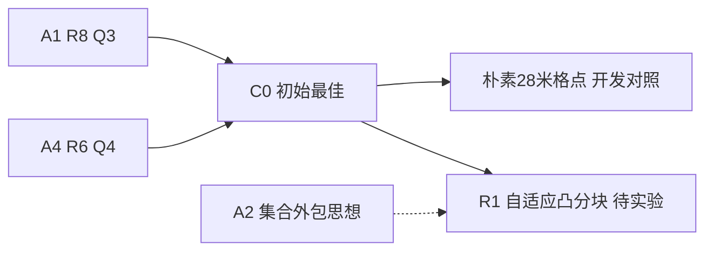

# B2 优化路径

## 时间线

- **2026-09-11，R1实验前**：读取六路线报告、源码差异、43轮全量原始行、训练/开发记录。观察到固定光学方格覆盖尚未直接优化。计划以A4 R6为Q4执行父方法，用20米圆认证的自适应凸分块减少停点；Q3精确保留A1 R8。先比较父方法、朴素28米格点、自适应分块三种开发变体，风险与接受规则见[plan.md](plan.md)。尚无性能结论。

源/结果链接：[父A1](../20260911_breakthrough/baseline/A1_space_R8.py)、[父A4](../20260911_breakthrough/baseline/A4_directional_R6.py)、[旧轮复算](research/prior_rounds_recomputed.json)。候选冻结与结果产生后追加真实链接，不删除失败分支。

- **R1实验后**：R1在4800局全部全清且正常退出，Q3逐局保持C0；Q4两批均改善，combined降低0.471296秒/源（0.08769%），按协议刷新B2最佳。仍有389局更慢，收益很小。 候选[r1](snapshots/r1.py)；[完整结果](results/r1_exposed/summary.json)、[单局退步](results/r1_regressions.json)。决策：accepted。
