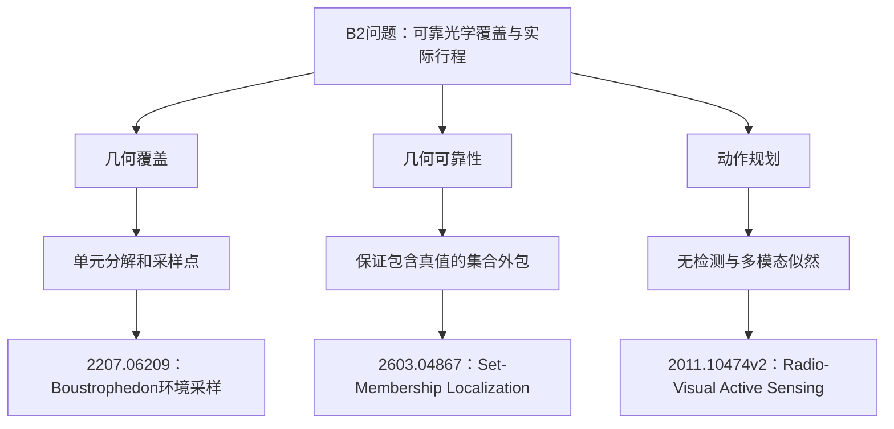

# B2 阶段研究报告：认证光学分区与分区相位

研究日期：2026-09-11。因用户要求先看此前成果，本路线完成已经启动的R3验证后暂停；没有进入R4，尚未达到原协议“连续两轮不刷新”的经验停止条件。本轮没有生成新的最终验证样本，没有执行官方Windows演练。

当前保留 **R3**：4800/4800局全部清除、正常退出、零异常，合计清除61940个源。Q3任务字段逐局等同C0；Q4已暴露两批合并均值由 **537.452219降至536.872676秒/源，降低0.107831%**。这是很小的本地回归收益，Q4仍有288局比C0更慢。R2验证了一个正确但更慢的非凸碎片方案，完整保存负结果。

可直接查看[优化路径与Mermaid图](optimization_path.md)、[逐轮全部场景/退步](iteration_log.md)、[候选身份](best.json)、[原始结果](results/r3_exposed/case_metrics.json)、[预算](execution_budget.json)、[阅读覆盖](reading_coverage.json)及[文献来源映射](literature.json)。

## 一、从六条既有路线得到的判断

机器读取和重算清单包含629个文件、4,828,446行，覆盖原六路线43轮的完整回归与可识别开发/训练记录。该数量包括重复结果、源码与机器解析行，不是独立样本数，也不代表逐行人工阅读。全部六份报告、文献账本和源码差异纳入判断；缓存论文正文实际重读仅下文明确的3篇指定页，其他论文采用已有路线记录。

| 既有证据 | 对本路线的约束或启发 |
|---|---|
| A1空间路由在Q3更强；A4可见性恢复在Q4更强 | 用按题选择的C0作为共同强对照，不能把这一组合本身称创新 |
| A2集合排除可能保持真值，但更紧几何不一定改变任务 | R2必须报告停点/失败clear/实际时间，不把区域缩小本身当加速 |
| A3聚簇压力开发含全定向配置，不能作为合法Q4覆盖证据 | B2开发强制Q4至少一个全向和一个定向，源数10–16，真值仅评测层读取 |
| A4 R4失败clear假设剪除、R7成本代理等已有负结果 | R3将失败信息限定为双向分区选择的消融，不能说失败权重普遍有效 |
| A5静态单独消融更慢、上下文组件贡献主要收益 | 不用“学习/融合”名称替代组件对照；B2只实现有几何依据的局部机制 |
| A6若干特征移除反而更快 | 保留简化父方法和负结果，不把最复杂版本自动作为最佳 |

详细旧数据重算见[43轮原始复算](research/prior_rounds_recomputed.json)。A5异构嵌套schema单独处理，实际train/dev计数及静态/上下文消融见[a5_schema_audit.json](research/a5_schema_audit.json)；A2某些只存差值的记录没有complete字段，不能将字段缺失误称失败。

## 二、新机制与实现边界

### R1：自适应凸分块覆盖

以第一条示向度作为横轴，把当前含真值的凸多边形分成高度不超过28米的横带；每带从左向右扩展凸块，用全部顶点的最小包围圆半径≤19.9999米作为接受条件。对凸块而言，任一点是顶点凸组合，距圆心不超过顶点最大距离，因此单次clear覆盖整个块。分块并集覆盖原多边形，减少固定25米格点在狭窄边界附近的冗余。

Q3精确委托旧A1 R8。Q4保留旧A4 R6的发现、可见性、恢复和退出机制，只替换有限光学覆盖点。开发比较父25米格点、朴素28米格点、自适应凸分区，不能仅据点数下降就归因完整任务提速。

### R2：失败圆盘之外的非凸剩余区域

失败clear说明对应20米闭圆盘内没有未清除的该频道源。R2去掉半径19.9999米圆内接正12边形，保留外部的凸碎片并分别重新分区。这比凸包回填更忠实地保留非凸形状，但制造许多小块，重复服务边界。独立开发中安全删点对照与R1完全一致，碎片法更慢；完整4800回归也比R1慢。

这说明本次碎片表示和服务构造无效率收益，不能推导“失败clear信息没有用”。几何排除是可靠的，服务点数量与路由组合才是退步风险。R2结果保留，最佳回退R1。

### R3：左右双向分区相位

同一多边形分别从左右两端开始贪心分区，会把短尾块留在不同侧。反射是等距变换，两套覆盖均完整。R3先保留两套各自完整的中心展开路线，再比较完整路程或预测首次命中成本。最终保留开发最好的有限位置权重方案：仅剔除距旧失败clear≤20米的离散假设点，权重为空回到多边形顶点；不裁剪用于认证的多边形。

期望成本按每步“移动/5+3秒”乘未覆盖假设权重累加，只影响两套完整覆盖的选择。没有校准后验、全局最优保证，也没有把两个父方法的时间上界直接相加。覆盖上界仍在执行前逐条检查。

## 三、开发对照与所有尝试

每轮独立生成336个合法Q4案例，覆盖7种空间/数量场景×6种误差模型×8种子。三轮种子不同且避开4800已暴露样本；没有训练或权重学习。开发用于选择方案，不称为盲测。未使用已暴露批次作隐蔽参数网格。

|轮次|开发方案|实际执行|全清|Q4秒/源|
|---|---|---:|---:|---:|
|R1|parent25|336|336|522.236178165|
|R1|naive28|336|336|522.052666645|
|R1|adaptive|336|336|521.685431244|
|R2|R1|336|336|527.007757573|
|R2|safe_prune|336|336|527.007757573|
|R2|residual12|336|336|527.455326082|
|R3|R1|336|336|529.121106297|
|R3|shortest_full|336|336|528.972786686|
|R3|expected|336|336|528.932009466|
|R3|expected_failures|336|336|528.857104144|

R1开发选择adaptive；R2碎片法开发已慢，仍冻结完整回归以保存可复查的负结果；R3选择expected_failures。R3的“失败权重”只在该双向分区决策上比其无失败权重版更好，不能外推成全策略通用改进。开发逐局计数和组件状态均保存在每轮episodes.jsonl。

## 四、三轮完整4800局回归

v1和previous_final都已经暴露。每批每题1200局，合并每题2400局；合并取每局秒/源的算术均值，完整性先于时间比较。C0 Q3=A1 R8，Q4=A4 R6，是已验证的强对照。

|版本|v1 Q3|v1 Q4|previous_final Q3|previous_final Q4|combined Q4|决定|
|---|---:|---:|---:|---:|---:|---|
|C0|270.531504612|534.426811491|271.578457561|540.477625619|537.452218555|对照|
|R1|270.531504612|533.875864411|271.578457561|540.085979726|536.980922068|accepted|
|R2|270.531504612|534.019974475|271.578457561|540.421658250|537.220816363|rejected|
|R3|270.531504612|533.715144321|271.578457561|540.030208154|536.872676238|accepted|

三轮每轮均4800/4800全清。R1、R3相对当时最佳两题均不差且至少一题更好；R2较R1慢，因此回退。R3比R1再降低0.108245831秒/源，Q4逐局相对R1为529快、1668同、203慢；相对C0为946快、1166同、288慢。

### 当前R3的全部分组

Q3在每批每个场景的任务指标均与C0相同，下表列出Q4全部12场景×2批；前三轮全部48个分批分题场景记录位于[iteration_log.md](iteration_log.md)，每轮单局退步JSON也完整保留。

|批次|场景|C0秒/源|R3秒/源|差值|快/同/慢|
|---|---|---:|---:|---:|---|
|v1|cell500_shared_field|535.379477|534.028275|-1.351202|41/49/10|
|v1|cell50_shared_field|535.283874|534.395604|-0.888269|40/47/13|
|v1|edge_mixed_min_radius|582.762511|582.465935|-0.296576|11/77/12|
|v1|exactly10_sources|673.865203|673.011020|-0.854183|35/56/9|
|v1|exactly16_sources|419.145651|419.054818|-0.090833|33/53/14|
|v1|fixed_negative_bias|533.864735|533.380682|-0.484053|44/39/17|
|v1|fixed_positive_bias|536.567679|535.720283|-0.847397|46/37/17|
|v1|minimum_radius|555.005686|554.778099|-0.227587|32/51/17|
|v1|offcenter_cluster|487.657690|488.220647|+0.562957|53/34/13|
|v1|origin_cluster|485.782943|483.564725|-2.218218|49/45/6|
|v1|reference_assumed|534.190736|533.247034|-0.943702|37/51/12|
|v1|smooth_shared_field|533.615552|532.714609|-0.900943|47/40/13|
|previous_final|cell500_shared_field|543.818907|543.325984|-0.492923|46/48/6|
|previous_final|cell50_shared_field|543.940867|543.472286|-0.468581|38/50/12|
|previous_final|edge_mixed_min_radius|586.748077|586.666099|-0.081978|18/70/12|
|previous_final|exactly10_sources|667.061044|666.712193|-0.348852|28/58/14|
|previous_final|exactly16_sources|416.600696|416.299774|-0.300922|35/52/13|
|previous_final|fixed_negative_bias|545.681594|545.018540|-0.663054|47/41/12|
|previous_final|fixed_positive_bias|545.528452|545.031106|-0.497347|53/35/12|
|previous_final|minimum_radius|563.835529|563.493887|-0.341642|29/61/10|
|previous_final|offcenter_cluster|484.840453|483.889831|-0.950622|55/36/9|
|previous_final|origin_cluster|500.141714|499.715932|-0.425783|51/43/6|
|previous_final|reference_assumed|543.133965|542.812837|-0.321128|36/51/13|
|previous_final|smooth_shared_field|544.400209|543.924031|-0.476178|42/42/16|

### 单局最差退步及边界

|案例|比C0慢的秒/源|源数|R3失败clear|
|---|---:|---:|---:|
|LOCAL-v1-q4-offcenter_cluster-5067|+72.266464|16|8|
|LOCAL-final-q4-origin_cluster-1084679581|+66.639982|11|12|
|LOCAL-v1-q4-offcenter_cluster-5097|+53.615111|13|11|
|LOCAL-final-q4-fixed_positive_bias-1272768060|+48.839268|16|7|
|LOCAL-v1-q4-offcenter_cluster-5094|+27.451164|11|16|
|LOCAL-v1-q4-exactly16_sources-5058|+25.355794|16|4|
|LOCAL-v1-q4-exactly16_sources-5018|+23.964480|16|15|
|LOCAL-v1-q4-minimum_radius-5022|+22.253322|14|6|
|LOCAL-v1-q4-reference_assumed-5084|+12.791206|14|10|
|LOCAL-v1-q4-origin_cluster-5001|+12.625177|14|7|

单局退步可能包含服务位置改变后对后续观测、扫站顺序的连锁影响；以上是实际配对差值，不将所有差值直接解释为某个单步机制的因果贡献。

## 五、耗时分解、预算和源码身份

|Q4版本|每源移动秒|每源动作及舍入秒|每局移动米|每局失败clear|
|---|---:|---:|---:|---:|
|C0|394.257291|143.194928|24812.816|4.565833|
|R1|393.971155|143.009767|24794.082|3.703750|
|R2|394.064618|143.156199|24800.034|4.336667|
|R3|393.879170|142.993506|24788.728|3.602917|

移动秒按distance/5计算，其余由总虚拟秒相减得到，包含动作和微秒舍入；不伪造未保存的换频道单独计数。候选现实耗时含本地Python计算，C0缓存现实耗时属于历史运行，不能据此宣称机器性能加速。

|轮次|开发运行|quick|full|补旧final|总运行|四段实测墙钟秒|
|---|---:|---:|---:|---:|---:|---|
|R1|1008|120|2400|2400|5928|21.695/1.423/28.788/27.771|
|R2|1008|120|2400|2400|5928|22.029/1.491/29.360/28.238|
|R3|1344|120|2400|2400|6264|28.697/1.534/29.025/27.801|

合计18,120次策略任务执行。独立开发具体案例1008个，已暴露具体案例4800个；quick属于full，full2400行由exposed程序按同SHA复用，不能把重复执行数写成独立样本数。14项规则检查每轮一次；R1/R3各500个几何多边形，R2另200个剩余区域检查；这些单列，不混入任务样本数。

|版本|SHA256|实际包含该候选的代码commit|
|---|---|---|
|R1|`0907ecbf2d37d8f6ba429b24edcd42b2284f443fb1fafd538065522be42639fc`|`6c5014e11991037d5ca00c5e96a4adbe5dba0a9f`|
|R2|`9797d0681973db1652886cb4b3e847dbf7ada8bd94206b68b09f7dcb8a14d0da`|`253922d1148be57408e06649bccc2ba3ef79b5e3`|
|R3|`d32722be8143b5a048d1ab7b4d130721ce478bc065f782aa88b940bbe496bb62`|`253922d1148be57408e06649bccc2ba3ef79b5e3`|

当前部署需复制[snapshots/r3.py](snapshots/r3.py)、[parent_a1.py](snapshots/parent_a1.py)、[parent_a4.py](snapshots/parent_a4.py)三个文件，保持同目录。只需标准库，没有训练权重，也不从其他工作树读取运行依赖。[dependencies.json](dependencies.json)记录父模块SHA；[stage_identity_audit.json](results/stage_identity_audit.json)复核每轮4800个唯一案例ID、候选和父散列，以及Q3逐局12个任务字段等价。

本地测试、文档和结果已经提交至本路线分支。最终远端推送状态由主协调确认；本次子任务push被自动审核以具体仓库授权证据不足为由拒绝，没有据此声称已上传。

## 六、连续覆盖、退出与100小时上界

1. 真实源始终包含在有界示向度半平面和接收范围外包的交集中。R1/R3保持父多边形；R2仅去掉严格位于失败20米圆内的正12边形，因此也不会删除可能的真源。
2. 凸块所有顶点距服务点≤19.9999米，则全块都在该20米圆内。R1横带和轴向连续分块覆盖原多边形；R2分割后的碎片覆盖剩余区域；R3镜像前后保持距离，左右两套均覆盖原集合。微小共点去重距离<1e-7米，仍小于0.0001米半径余量。
3. 概率权重只决定访问顺序或完整覆盖选择；不能取消覆盖证书。搜索站点和退出条件保持父法：达16个源上界，或所有尚未发现频道完成全部几何覆盖且无待处理正观测。
4. 第一次测向的保守横向全宽<54米，每带≤28米，所以至多2带。启用新方法时多边形外包圆半径≤300米，纵向宽≤600米；20米宽×28米高的矩形半径<20米，所以非末块至少推进20米，R1每带≤31块。R2可能增加碎片，但总候选点>100或计算出的整条路线界过大即回父法。
5. 所有新完整覆盖执行前验证 B=min(到两端距离)/5+2×相邻点总距离/5+3×点数+2≤10000秒。中心展开路线内部长度≤原序列的两倍，该不等式同时包含成功clear额外2秒；左右相位也分别校验。
6. 虚拟时间≥180000秒后新optical_points与optical_route均退回父25米snake。最多一条已开始的新覆盖跨阈值，按10000秒计；之后最多16源×4000秒及剩余扫描27000秒。因此281000秒<360000秒。普通动作/整批同站测量跨阈值也被该10000秒余量涵盖。动作点仍在3500米范围内。

早期plan.md曾将首次测向横向全宽粗记为53米；严格外包计算应为约53.08米，因此本报告使用<54米。仍只需2个28米横带，不改变已用分区算法或时间界。

父法余量依据为22站发现和蛇形单源上界；B2在上述公式中替换跨阈值覆盖项，未将两个父算法的上界机械相加。这个证明依赖题面误差界、合法动作接受和默认配置。现实20分钟包含通信，无法由虚拟几何界推出；HTTP未改，仍须官方环境验证。

## 七、文献证据与自己的实现

本报告沿用automated-research-report的来源等级、实际阅读范围和机制映射要求。没有新增联网检索、没有核验新会议身份，也不声明近期领域覆盖或SOTA。旧六路线的所有文献条目逐项保存在[prior_literature_complete.json](research/prior_literature_complete.json)。本轮实质重读3篇缓存正文指定页如下；只借方法原则，未复现论文系统。

### [Environmental Sampling with the Boustrophedon Decomposition Algorithm](https://arxiv.org/abs/2207.06209)

本轮实际重读PDF页码：[2, 3]，来源为已有缓存正文，SHA和路径见literature.json。

论文按障碍连通拓扑分块并栅扫，逐格采样且可从四角进入；B2只借分区覆盖与进入相位这一原则。

进入B2的实现：R1/R3 partition_points、PhaseSolver.optical_points。

边界：论文环境采样不提供B2连续20米清除覆盖证明；B2贪心最小圆分区是本题自拟。

### [Set-Membership Localization via Range Measurements](https://arxiv.org/abs/2603.04867)

本轮实际重读PDF页码：[3, 7]，来源为已有缓存正文，SHA和路径见literature.json。

原文区分中心估计与保证包含真值的外包；差分距离方程是其特有机制。

进入B2的实现：R2 residual_components保守排除；R1全凸块最小包围圆认证。

边界：本题没有距离读数，不复现SOCP/SDP；R2碎片机制正确但本地任务更慢。

### [Probabilistic Radio-Visual Active Sensing for Search and Tracking](https://arxiv.org/abs/2011.10474v2)

本轮实际重读PDF页码：[3]，来源为已有缓存正文，SHA和路径见literature.json。

公式15按可见域内外给未检测不同似然，公式16联合两模态；控制目标为MAP接近且正文承认纯利用。

进入B2的实现：继承A4 visibility_hypotheses；R3仅失败clear修正有限位置权重再比较两个完整覆盖。

边界：发射端半圆与相机视域模型不同，B2是离散近似排序而非校准后验；不声称概率最优或原论文复现。

既有论文的实验数据只作为原路线文献记录保留，不作为本题性能证据。本轮没有检验论文的完整算法或精确复现，原论文有效性与B2局部方案成败不能互相替代。

## 八、阶段结论与尚未执行部分

自适应凸分块R1有很小平均收益；保留非凸几何并不足以提高效率，R2失败；双向分区相位R3在这两批已暴露样本上进一步小幅改善。较强结果是覆盖证明、负结果和逐步组件对照可复查；较弱之处是收益约千分之一且仍存在单局/场景退步。

用户要求阶段暂停后，没有执行R4融合Q3集合约束等新想法，也没有生成新final案例。下一次继续时若需要判断迁移，应先固定当前候选并开展新样本验证；不能把本轮重复研发数据当作未见验证。官方Windows通信和正式成绩仍未测试。
