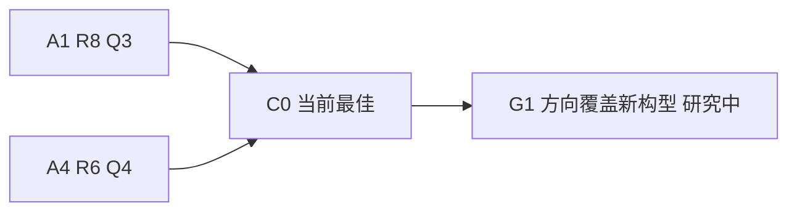
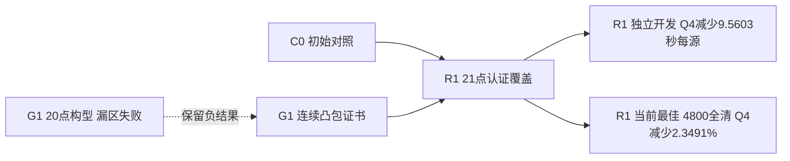
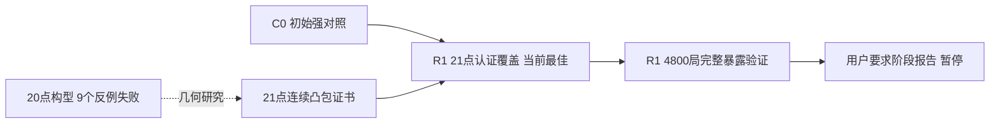

# B3 优化路径

2026-09-11：完整读取六路线报告与文献记录，处理751份旧文件；复核43轮quick/full原始216720行。原始行审核是保存结果复算，没有重跑旧算法。

2026-09-11：G1实验前登记——从Q4覆盖机制重新出发，检验20/21点能否满足真正的任意方向覆盖条件。父C0；当前最佳仍C0；结果尚待验证。依据、预算和排除边界见[plan.md](plan.md)、[idea_log.md](idea_log.md)。

2026-09-11 10:03：G1得到[21点连续覆盖证书](research/certificate_21_999_1864.json)，11200个叶方格全部以整数运算核验；20点反例保留于[几何探查](research/geometry_probe.json)。由此冻结[R1](snapshots/r1_solver.py)，只替换Q4覆盖点。独立开发C0/候选各288局全部完成，Q4为557.579754→548.019457秒/源，Q3逐局一致；这是开发数据。正式回归前登记详见JSON。

2026-09-11：R1完整4800局通过并成为当前最佳，代码提交 `4aab7c27c791877ac220e3fe78ba7028764d935e`。Q4两批分别减少12.955493/12.294656秒/源，Q3逐局一致。边缘场景退步保留。下一步R2尚未启动。

2026-09-11：用户要求先查看已有成果，B3在R2开始前暂停。R1为本阶段唯一冻结候选和当前最佳；R2/R3未启动，本次整理没有新增实验或新最终样本。暂停来自用户阶段选择，未达到连续不改善的经验停止条件。

