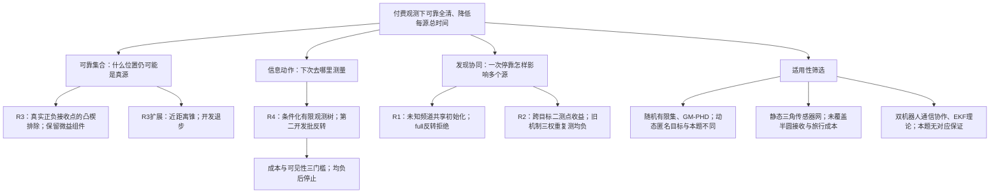

# E3 最终机制树与选择理由

四轮实际方法研究覆盖三类新实现与一次旧机制复测；额外候选、反转和未采用方向全部保留。树的叶子是具体改动或明确不适用项，不能把文献条数当成算法数。

|分支|来源与实际迁移|代码位置|证据与决定|
|---|---|---|---|
|R1 共享发现|ISER2013共享初始化；RFS来源辅助区分已发现和未知频道|snapshots/r1_development.py、r1.py 的机会探测入口|两批96开发微益；full4800 Q4慢0.26045%，拒绝|
|R2 跨目标第二测点|ATL2020联合信念启发；明确是此前A3_R3机制在S1的复测|snapshots/r2_development.py 的second_point|三个权重0.5/1/3均开发退步，未跑full；非TD3复现|
|R3 凸接收负约束|本项目独立推导；ICRA2013技术报告在冻结后才恢复，只用于事后理论对照|snapshots/r3.py 的exclude_forced_visible_wedge、refine_no_signal|基础full4800全清，Q4微益0.05846%；扩展近距离锥开发负|
|R4 有限观测树|IROS2011观测分支、CDC2016非短视树；保留TRO2015随观测重规划的原则|snapshots/r4_development.py 的second_point/future/score；r4_guarded.py|48开发正，第二96全部负；三门槛仍负，未full|
|不移植：RFS/GM-PHD|ISRR2015系列与ICRA2017有限视场搜索|无实现|本题静态、频道可辨，没有目标生灭、数据关联与虚警状态；后验存在概率不能代替全清证据|
|不移植：静态网与多机器人理论|ICRA2013技术报告、TRO2015、ICRA2012/JFR2014|无新增实现|原论文几何/CRLB/EKF条件没有覆盖本题接收半圆、付费单机器人和有界非随机误差|

所有策略评估仍沿用本地合法混合源条件；没有新增留出、官方Windows执行或论文原方法性能复现。本阶段按负结果与当前假设饱和停止，不宣称数学收敛或机制穷尽。
