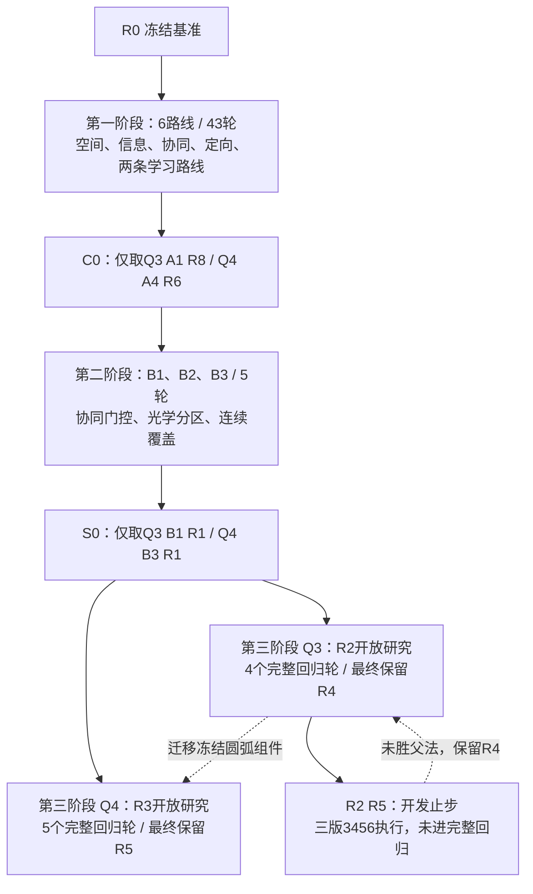
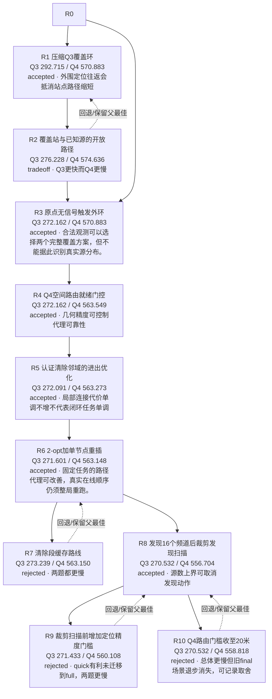
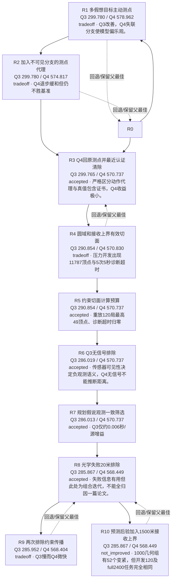
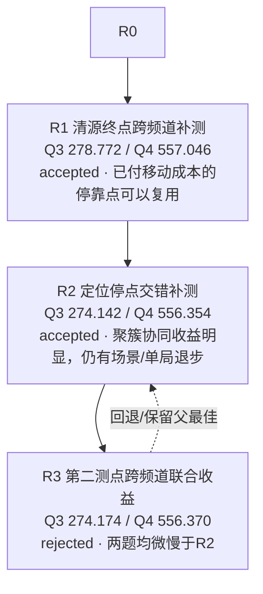
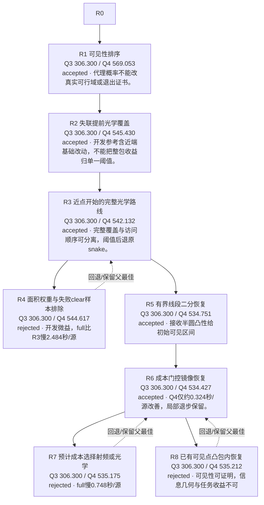
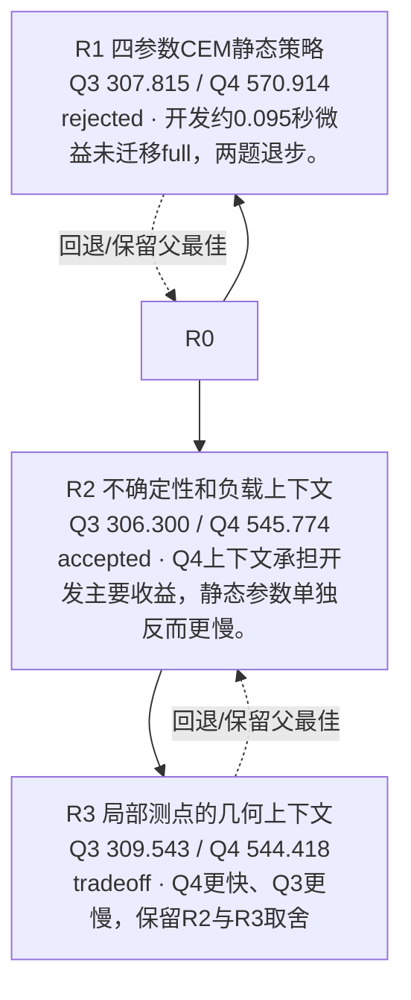
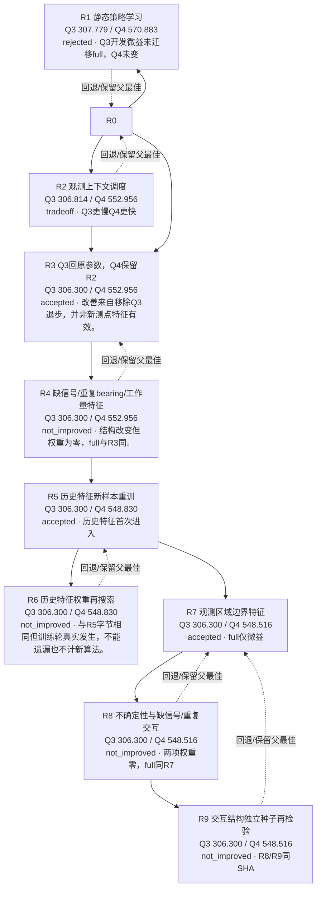
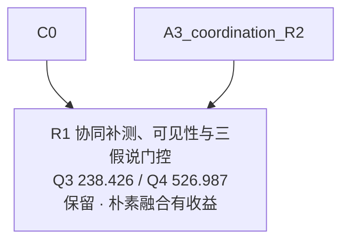
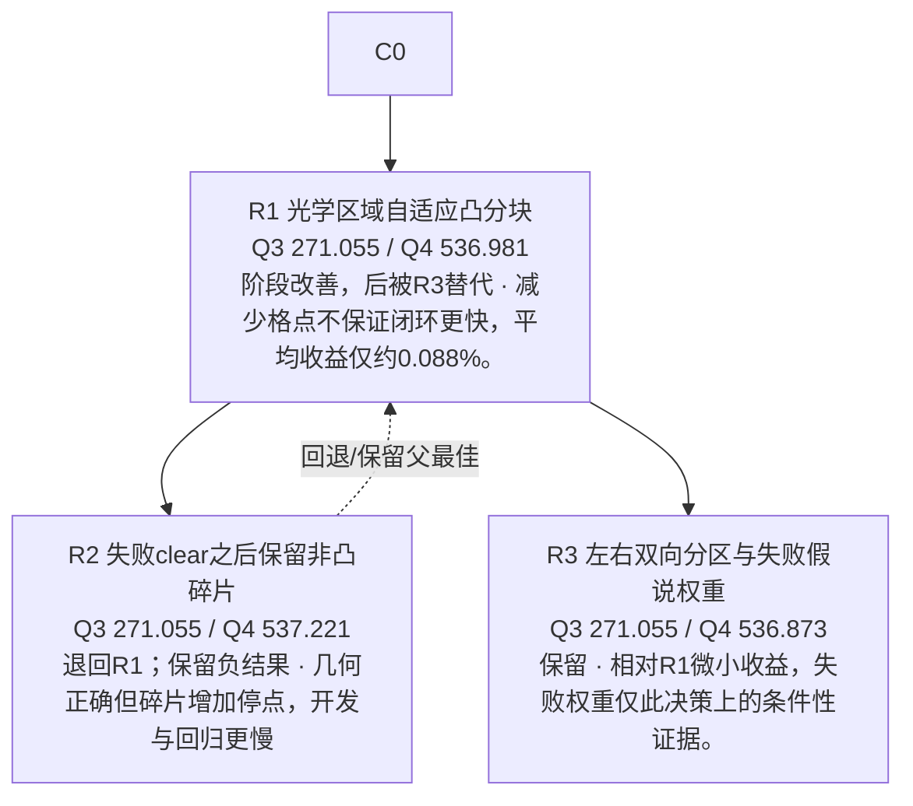
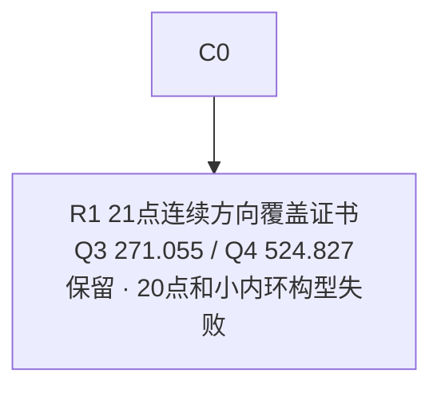

# 全历程方向图

截至2026-09-11，当前图谱共70节点、57个完整回归轮次：六路线43轮＋第二阶段5轮＋第三阶段9轮。其余为1个开发止步、1个历史几何开发、1个本阶段几何诊断、3个未实施方向、6个背景与1个取消节点。全部数字为本地结果。第三阶段两条路线已完成研究，保留Q3 R2 R4与Q4 R3 R5。

完整交付见[FINAL_REPORT.md](FINAL_REPORT.md)，第三阶段逐轮变化、失败与预算见[STAGE3_PROGRESS.md](STAGE3_PROGRESS.md)；本页下半部保留48轮历史详情。

S0按题选Q3 B1 R1、Q4 B3 R1，合并238.426471/524.827144秒/源。两批4800局均已暴露；该分派不是第三阶段新收益。

## 总览

第一、二阶段方框聚合研究方向；C0与S0只采用框中标明的组件。第三阶段框聚合各自迭代链，真实逐轮设计父、融合和回退边见[第三阶段详细图](STAGE3_PROGRESS.md)及[nodes索引](exploration_index.json)。开发止步不计入57个完整回归轮次；两个最终保留框表示独立组件，统一入口与新最终验证由协调者另行登记。

## 如何读数

旧A节点主表是v1每题1200局，对照R0；B节点主表是两批合并每题2400局，对照C0。它们不能跨表直接相减当成同批提升。十个A冻结候选的历史新样本放在JSON的later_validation；不回写原有选择。每节点effects保留全部题/批/场景、分母、快同慢、最大退步、最差局和移动/动作分解。

## A1_space · 空间覆盖与移动成本

|节点|做了什么|Q3 / Q4 秒/源|选择与启发|
|---|---|---|---|
|A1_space_R1|将Q3搜索环缩至1124米，维持连续覆盖；Q4原样。|292.714541 / 570.883371|accepted；外围定位往返会抵消站点路径缩短；边缘和原点簇退步。|
|A1_space_R2|将覆盖站和区域中心合并规划，三起点2-opt，每次执行首任务后重算。|276.228217 / 574.636326|tradeoff；Q3更快而Q4更慢；不稳定区域中心不是真实服务终点。|
|A1_space_R3|Q3原点全频道无信号时切回认证外环；Q4调度回到基准。|272.161671 / 570.883371|accepted；合法观测可以选择两个完整覆盖方案，但不能据此识别真实源分布。|
|A1_space_R4|Q4待清区域半径均≤100米时才开放路径；显式校验换环前未扫描非原点站。|272.161671 / 563.549303|accepted；几何精度可控制代理可靠性；扫描证据必须与实际站坐标一致。|
|A1_space_R5|在半径20-r可靠清除圆内择点，最小化预测进入与离开距离。|272.090541 / 563.273068|accepted；局部连接代价单调不增不代表闭环任务单调；收益很小。|
|A1_space_R6|穷举移除重插并再次2-opt，保留原三条路线作为代理候选。|271.600919 / 563.147968|accepted；固定任务的路径代理可改善，真实在线顺序仍须整局重跑。|
|A1_space_R7|任务集合相同时保持顺序，到新扫描站才清空缓存。|273.239020 / 563.150239|rejected；两题都更慢；在线新几何需要及时重规划，回退R6。|
|A1_space_R8|正观测/已清互异频道达到上限16即取消额外发现站，但全部已知源仍需clear成功。|270.531505 / 556.703578|accepted；源数上界可取消发现动作；发现证书和清除/退出证书须区分。|
|A1_space_R9|只有所有待清半径≤100米才执行16频道裁剪。|271.432619 / 560.108327|rejected；quick有利未迁移到full，两题更慢；回退R8。|
|A1_space_R10|Q4只在待清区域达到认证清除尺度时开放全局路径，Q3与裁剪保持。|270.531505 / 558.818078|rejected；总体更慢但旧final场景退步消失，可记录取舍；最佳仍R8。|

## A2_information · 信息获取与定位不确定性

|节点|做了什么|Q3 / Q4 秒/源|选择与启发|
|---|---|---|---|
|A2_information_R1|从多边形求积点推演未来bearing与后验，按后续任务成本选择第二测点。|299.779752 / 578.962366|tradeoff；Q3改善，Q4失联分支使模型偏乐观。|
|A2_information_R2|修订第二测点的不可见成本和任务预测，仍保留多假想目标。|299.779752 / 574.817122|tradeoff；Q4退步缓和但仍不胜基准；quick不可替代full。|
|A2_information_R3|Q3保留主动测点，Q4恢复父测点；clear位置满足全顶点20米约束。|299.765403 / 570.737313|accepted；严格区分动作代理与真值包含证书，Q4收益极小。|
|A2_information_R4|用已知1800米源域和1500米接收上界收紧保守可行区域。|290.853779 / 570.829958|tradeoff；压力开发出现11787顶点与5次5秒诊断超时；几何正确不等于可部署。|
|A2_information_R5|限制有效约束与最近认证清除复杂度，保持所需保守几何。|290.853803 / 570.737313|accepted；重放120局最高49顶点、诊断超时归零；不要把5秒诊断阈值冒称官方限时。|
|A2_information_R6|全向no_signal排除1000米圆内部，残区取保守凸包；Q4不作同样排除。|286.018529 / 570.737313|accepted；传感器可见性决定负观测语义，Q4无信号不能推断距离。|
|A2_information_R7|按圆域、接收上界及Q3无信号筛选有限规划点，空时回原假说。|286.012745 / 570.737313|accepted；Q3仅约0.006秒/源增益；假说只排序不承担存在性证书。|
|A2_information_R8|两题均保守排除失败clear圆，保持完整搜索和格点兜底。|285.866703 / 568.449412|accepted；失败信息有用但此处为组合迭代，不能全归因一篇论文。|
|A2_information_R9|在无信号与失败光学约束间再传播一轮。|285.951924 / 568.403979|tradeoff；Q3慢而Q4微快；几何变紧不保证双题任务改进。|
|A2_information_R10|仅规划预测的bearing后验添加24个接收上界外切半平面。|285.866703 / 568.449412|not_improved；1000几何组有52个变紧，但开发120及full2400任务完全相同；保留更简单R8。|

## A3_coordination · 多源与多频道协同

|节点|做了什么|Q3 / Q4 秒/源|选择与启发|
|---|---|---|---|
|A3_coordination_R1|localize结束时预测其他已发现频道半径减少≥30米才真实measure。|278.772056 / 557.046187|accepted；已付移动成本的停靠点可以复用；假想bearing只能影响排序。|
|A3_coordination_R2|在单源定位measure后补测其他频道，递归锁和当前目标排除。|274.141894 / 556.354234|accepted；聚簇协同收益明显，仍有场景/单局退步；开发含270/720次全定向压力执行。|
|A3_coordination_R3|在原两个测点间加入其他频道预测收益，单频道截断200米且权重0.20。|274.173562 / 556.370057|rejected；两题均微慢于R2；更高协同信息代理不等于整局更快。|

## A4_directional · 定向发射与可见性

|节点|做了什么|Q3 / Q4 秒/源|选择与启发|
|---|---|---|---|
|A4_directional_R1|位置/方向/半径假说只用于测点选边及救援排序；开发选600米失联惩罚。|306.300434 / 569.052915|accepted；代理概率不能改真实可行域或退出证书。|
|A4_directional_R2|半径≤300米时启用完整25米光学snake并选择较近端点。|306.300434 / 545.430065|accepted；开发参考含近端基础改动，不能把整包收益归单一阈值。|
|A4_directional_R3|从最近格点向一端再另一端，以预计首次命中选择方向；内部路程≤2L。|306.300434 / 542.132481|accepted；完整覆盖与访问顺序可分离，阈值后退原snake。|
|A4_directional_R4|位置假说按三角面积分权，排除失败20米内样本。|306.300434 / 544.616595|rejected；开发微益，full比R3慢2.484秒/源；回退R3。|
|A4_directional_R5|从旧可见点向失联点最多二分两次，失败再走原救援环。|306.300434 / 534.750641|accepted；接收半圆凸性给初始可见区间；有限二分不保证成功，须兜底。|
|A4_directional_R6|一次镜像仅当移动/检测成本除可见概率优于二分点时尝试。|306.300434 / 534.426811|accepted；Q4仅约0.324秒/源改善，局部退步保留。|
|A4_directional_R7|显式预计光学首次命中成本与射频后续清除成本，选择模态。|306.300434 / 535.175177|rejected；full慢0.748秒/源；稀疏位置假说和近似后续成本可能不足。|
|A4_directional_R8|选两可见点线段内点，加入成本门控及25%内缩。|306.300434 / 535.212148|rejected；可见性可证明，信息几何与任务收益不可；0快12慢1188同，回退R6。|

## A5_learning · 学习路线一：CEM上下文策略

|节点|做了什么|Q3 / Q4 秒/源|选择与启发|
|---|---|---|---|
|A5_learning_R1|任务级CEM优化低维静态参数，公开所有参数和轨迹。|307.815144 / 570.914417|rejected；开发约0.095秒微益未迁移full，两题退步。|
|A5_learning_R2|学习半径惩罚及任务优先倍率；开发门槛1.28标准误，Q3保留原参数。|306.300434 / 545.773530|accepted；Q4上下文承担开发主要收益，静态参数单独反而更慢。|
|A5_learning_R3|用观测投影长度响应推进和横移参数，增加开发样本。|309.543034 / 544.418228|tradeoff；Q4更快、Q3更慢，保留R2与R3取舍；不拼接新候选。|

## A6_learning · 学习路线二：参数搜索与历史特征

|节点|做了什么|Q3 / Q4 秒/源|选择与启发|
|---|---|---|---|
|A6_learning_R1|每题48参数×96训练，前五和父版本各192开发，部署四接口。|307.779342 / 570.883371|rejected；Q3开发微益未迁移full，Q4未变；退回原版。|
|A6_learning_R2|可行半径、目标邻近度、相对下一站距离进入learned_source_cost。|306.814064 / 552.956004|tradeoff；Q3更慢Q4更快；开发Q3约2.9%收益未迁移。|
|A6_learning_R3|只在Q4搜索第二测点上下文；0.5%开发门槛未过，新增权重为零。|306.300434 / 552.956004|accepted；改善来自移除Q3退步，并非新测点特征有效。|
|A6_learning_R4|加入三种历史特征并在新种子搜索，未达0.5%门槛回父行为。|306.300434 / 552.956004|not_improved；结构改变但权重为零，full与R3同。|
|A6_learning_R5|沿用R4特征、从R3行为在新种子训练；开发1.03%过门槛。|306.300434 / 548.829652|accepted；历史特征首次进入；quick变慢而full改善。|
|A6_learning_R6|新种子重搜历史特征与任务优先倍率，开发均不胜输入。|306.300434 / 548.829652|not_improved；与R5字节相同但训练轮真实发生，不能遗漏也不计新算法。|
|A6_learning_R7|由估计区域中心到圆心距离生成边界特征，搜索四参数。|306.300434 / 548.515689|accepted；full仅微益；后来新final Q3有1局退步，零权重不是行为等价证明。|
|A6_learning_R8|新增两个交互项，在新种子搜索，0.5%门槛未过。|306.300434 / 548.515689|not_improved；两项权重零，full同R7；更多特征未得支持。|
|A6_learning_R9|保持R8结构/范围/门槛重新训练，仍回输入。|306.300434 / 548.515689|not_improved；R8/R9同SHA；最终移除station_gain/workload/boundary开发反快，非普遍正贡献。|

## B1 · 强父法融合与机会测量

|节点|做了什么|Q3 / Q4 秒/源|选择与启发|
|---|---|---|---|
|B1_R1|强A1/A4父行为加入定位途中真实收费补测；Q3中心60米收益门槛，Q4三位置收益×可见概率60米。|238.426471 / 526.986851|保留；朴素融合有收益；Q4可见性有开发组件证据，三假说仅0.0602秒/源增益且Q3更慢。|

## B2 · 局部光学覆盖与相位

|节点|做了什么|Q3 / Q4 秒/源|选择与启发|
|---|---|---|---|
|B2_R1|沿示向度分成≤28米横带、最小包围圆≤19.9999米凸块，以服务圆完整覆盖。|271.054981 / 536.980922|阶段改善，后被R3替代；减少格点不保证闭环更快，平均收益仅约0.088%。|
|B2_R2|用失败圆内接12边形安全排除并重分凸碎片。|271.054981 / 537.220816|退回R1；保留负结果；几何正确但碎片增加停点，开发与回归更慢；回退R1。|
|B2_R3|左右两套完整覆盖；失败clear只删规划假说，用预计首次命中成本选择。|271.054981 / 536.872676|保留；相对R1微小收益，失败权重仅此决策上的条件性证据。|

## B3 · 连续定向发现覆盖

|节点|做了什么|Q3 / Q4 秒/源|选择与启发|
|---|---|---|---|
|B3_R1|原点+8个999米内环+12个1864米外环；11200四叉树叶共同近邻凸包整数证书。|271.054981 / 524.827144|保留；20点和小内环构型失败；新21点总体快但两批边缘最小半径都退步。|

## 有证据的融合与边界

- C0：A1 R8的Q3与A4 R6的Q4；S0：B1 R1的Q3与B3 R1的Q4，均只是题号分派。
- B1 R1：C0与A3 R2的定位停点协同结构，新增可见性/假说/门槛有明确开发对照。
- B2 R2由R1继续，A2失败clear约束属于inspired_by；B2 R3实际恢复R1，仅吸取R2失败诊断。
- 同主题文献、相同模块名称或读取另一份报告，不自动产生fusion边；未确认关系保留在来源账本，不画实线。
- A6 R6、R9分别与既有快照字节相同，但真实执行了新训练/开发；它们是探索节点，不是新增算法收益。

## 历史覆盖审计

解析932份文件、8,564,141行文本；完整复算127,200行历史优化候选full记录，以及24,000行旧final候选记录。重复读取、缓存对照和结构对象计数不是独立样本。48轮唯一性、引用、候选SHA和已存均值核对均通过。

实际阅读深度与限制见[reading_coverage.json](reading_coverage.json)，逐行复算审计见[raw_row_audit.json](research/raw_row_audit.json)。没有把程序全字节解析称为逐动作人工复盘，没有重新执行这些策略，没有重新通读所有旧论文。

第三阶段已冻结新节点见[STAGE3_PROGRESS.md](STAGE3_PROGRESS.md)；AI先读[紧凑索引](exploration_index.json)，再打开对应nodes/<id>.json。
