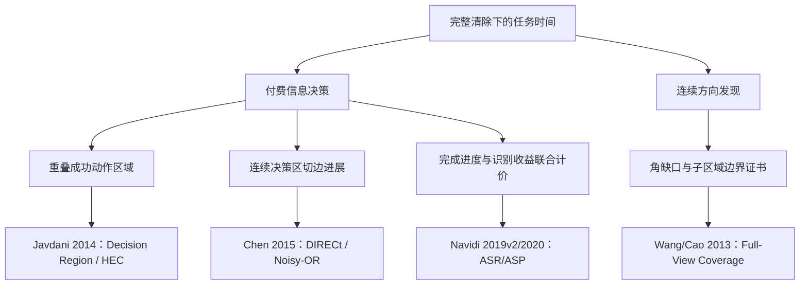

# 新文献支援报告

研究截止2026-09-11；两批4个论文家族、5份版本PDF。实际正文阅读深度逐篇记录，没有把下载等同全文深读。目的为支援当前S0及第三阶段已冻结进展，按信息收费、连续发现、完成动作三个决策对象筛选；不是领域全量综述，也不评SOTA。

本阶段研究已按用户允许近收敛收尾。R2将首批DRD启发转成动作费用代理并在R3冻结回归中保留，但只买“一步可clear”的门槛开发失败；第二批DIRECt随后在R5形成连续决策进展代理，原稿及两次正确性修正版共3456开发执行，两变体均未优于父法，最终保留R4。R3动态覆盖的有限轨迹诊断已冻结，没有在线版；同址clear与动态覆盖的原始想法早于本批新论文，不能反向归因。这些结果分别保存在研究者文件，本路线只读取、复算及重放几何证书，不运行策略；论文不能直接证明本题退步的原因。

## 机制分类树

|主路径|关键原文与实际阅读|本题可试机制|未迁移的保证|
|---|---|---|---|
|付费信息→重叠动作区域|[DRD 2014](https://proceedings.mlr.press/v33/javdani14.html)，PDF 1–8/9页|候选clear点20米圆作为重叠决策区；一步决策成本与radius_gain对照|有限确定假说、HEC近似界、离散假说全覆盖不能代替连续真值证书|
|付费信息→连续决策切边进展|[DIRECt 2015](https://ojs.aaai.org/index.php/AAAI/article/view/9694)，PDF 1–7/8页|共享多位置假说、clear候选；连续剩余边权与当前费用代理独立对照|特定EC² Noisy-OR构造；有限先验和固定测试费用；一般乘积不保证自适应次模|
|付费信息→相对完成收益和识别收益|[ASR/ASP](https://arxiv.org/abs/1606.01530v2)，1–7、12–13、18–19、22–25/28页|信息代理必须改变完成动作；移动费用另计|已知场景概率、次模完成函数、固定测试成本/度量路径条件|
|连续方向发现→角缺口/区域边界|[Full-view 2013](https://mcn.cse.psu.edu/paper/yiwang/tosn-wang13.pdf)，1、4–11、26–28/31页|B3叶格证书按频道加入实际测点，验证未来站是否冗余|θ<π/2相机模型、随机部署密度和barrier覆盖不能直接覆盖本题θ=π/2与静止源|

## 可直接实施与验收

完整参数边界、步骤、反例风险和事前验证方案见[第1批备忘](research_updates/001_decision_value_and_dynamic_cover.md)及[第2批中间决策进展](research_updates/002_intermediate_decision_progress.md)。它们保存当时建议，最终采纳与拒绝以[冻结增量](STAGE3_PROGRESS.md)、[逐节点索引](exploration_index.json)和[采纳时间线](research/adoption_timeline.json)为准。第2批同时保存R2 R3开发的1536行复算；DIRECt文章在该冻结轮之后读到，仅R5可标作实际启发。

|新资料|最终本地采纳|实测与边界|
|---|---|---|
|DRD2014|R2 R3单中心动作费用代理|完整4800暴露回归比R2快0.453470秒/源；并非HEC复现，收益不能全归因论文|
|DIRECt2015|R2 R5有限规划假说上的EC2/Noisy-OR代理|最终开发父/多位置费用/图代理231.260930396/231.366209748/232.454322791秒/源；三版重用384例，不进入新full，保留R4|
|Full-view2013|对R3先前独立动态cover想法补充角度端点和连续证书边界|12条已见轨迹的252单删站组合：2正证书、96分离见证、154未定；不能写成全局不可能或真实节时|
|ASR/ASP|任务完成收益与付费信息分开计价的分析框架|没有单独实施原算法，不声称本地性能贡献|

固定序多服务区联合选点、条件发现结束路由、Q4费用信息门控仍为未实施方向。开发和完整回归结果分开，不把基线轨迹上的离线评分当新策略运行，不把未实施方向计成失败实验。

## 阅读路线与范围

优化者先读备忘中对应任务，再读DRD第2–4与8页、DIRECt第3–5页、Full-view第5–8页；理论审查读ASR第6–7、12–13及18–19页。全部文章的原文问题、效果、边界、缓存SHA与实际页范围见[literature.json](literature.json)。公式页另外做图像核对，但完整PDF及其逐页文本只留本地忽略缓存，不上传到私有代码仓库。

检索词包含adaptive submodular ranking/routing、decision region determination、full-view coverage、redundant sensors、online coverage waypoints。搜索服务多次连接失败；原站arXiv、PMLR、AAAI OJS、作者实验室和Crossref成功，OpenAlex返回429；未据失败结果虚构检索覆盖。扩展发现集记录ASR引用的相关材料，但没有假装已深读。本阶段两批共4论文家族，阅读范围与未实现方向随交付保留。
