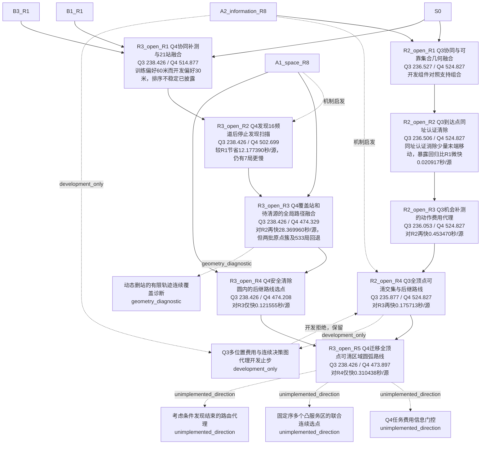

# 第三阶段冻结节点增量

只登记冻结并完成4800暴露评测的轮次；对照统一S0，节点详情另列真实设计父的逐批场景对照。R2 R3受首批DRD启发为费用代理，未实现HEC；较早独立想法与之后才收到的论文不反向归因。

|节点|合并Q3|合并Q4|真实来源及边界|
|---|---:|---:|---|
|[R2_open_R1](nodes/R2_open_R1.json)|236.527045338|524.827143981|开发组件对照支持组合；Q3两批原点簇仍退步，不能从集合收紧推单局改进。|
|[R2_open_R2](nodes/R2_open_R2.json)|236.506128826|524.827143981|同址认证消除少量末端移动，暴露回归比R1微快0.020917秒/源；主动测点降低距离却多付检测费。|
|[R3_open_R1](nodes/R3_open_R1.json)|238.426470616|514.876836277|训练偏好60米而开发偏好30米，排序不稳定已披露；24分批场景改善仍有886单局慢。|
|[R3_open_R2](nodes/R3_open_R2.json)|238.426470616|502.699446004|较R1节省12.177390秒/源，仍有7局更慢；发现上界证书不能取代clear成功证书。|
|[R2_open_R3](nodes/R2_open_R3.json)|236.052659069|524.827143981|对R2再快0.453470秒/源；新文献启发费用代理，未实现HEC。一步完成门槛失败原因仍需状态级核验。|
|[R3_open_R3](nodes/R3_open_R3.json)|238.426470616|474.329485904|对R2再快28.369960秒/源，但两批原点簇及533局回退；固定任务路径代理改善不等于每局改进。|
|[R2_open_R4](nodes/R2_open_R4.json)|235.876945812|524.827143981|对R3再快0.175713秒/源；最近进入点开发变慢。固定状态代理不增不代表在线总任务不增，原点簇仍退步。|
|[R3_open_R4](nodes/R3_open_R4.json)|238.426470616|474.207931097|对R3仅快0.121555秒/源；v1改善0.326473而previous_final慢0.083364，分批反转须保留。|
|[R3_open_R5](nodes/R3_open_R5.json)|238.426470616|473.897493000|对R4仅快0.310438秒/源；训练nearest胜route而开发反转，自父6个分批场景及281局回退，按用户允许近收敛收尾。|

## 开发止步、诊断与未实施方向

下列节点均不计入9个完整回归轮次，且没有借用旧回归冒充新候选结果。

|节点|类型|实际证据|
|---|---|---|
|[R3_dynamic_cover_diagnostic](nodes/R3_dynamic_cover_diagnostic.json)|geometry_diagnostic|即使免费提前加入未来停点，252个单删站组合仅2个被证书认可；154个未定不能写成失败或不可能。真实未知频道仍需付费检测。|
|[Q4_COST_GATE_PROPOSED](nodes/Q4_COST_GATE_PROPOSED.json)|unimplemented_direction|只在Q3有相邻组件结果；Q4尚无本方向开发或全回归，不能移用Q3收益。|
|[JOINT_CLEAR_ROUTE_PROPOSED](nodes/JOINT_CLEAR_ROUTE_PROPOSED.json)|unimplemented_direction|已测试的单clear点entry/exit不同于整段联合优化；尚未实施。|
|[CONDITIONAL_DISCOVERY_ROUTE_PROPOSED](nodes/CONDITIONAL_DISCOVERY_ROUTE_PROPOSED.json)|unimplemented_direction|全程路径代理可能牺牲早期发现；此为待检验假设，不能从个别退步证明因果。|
|[R2_open_R5](nodes/R2_open_R5.json)|development_only|最终父231.260930396、多位置费用231.366209748、图进展232.454322791秒/源；两变体多付检测费且推理更慢，保留R4。此否证只限具体代理，不反驳DIRECt定理。|

R2 R5三版各384案例×3配置，共3456执行；两次修正重用原开发样本。最终父/多位置费用/图进展Q3分别231.260930396/231.366209748/232.454322791秒/源，保留R4；不解释为DIRECt定理失效。动态覆盖的36次轨迹诊断重用12例，252单删站组合为2证书/96分离见证/154未定，没有新在线方案或节时结果。R1仅重算既存结果和重放几何证书，新增策略执行为0。

## 研究预算与阶段结束

|路线|完整冻结回归轮|实际策略执行|不同训练/开发案例|
|---|---:|---:|---:|
|R2_open|4|28320|1632|
|R3_open|5|35244|2880|

R2/R3实际执行合计63564，其中9轮完整已暴露回归43200执行；其余为训练、开发、快速子集、等价重放及诊断。当前保留Q3 R2 R4与Q4 R3 R5为独立冻结组件。协调者的统一入口和新最终验证单独登记；此图不凭两个均值拼接声称完成了联合实测。研究停止依据用户允许近收敛收尾，未声称全局最优或官方成绩。
