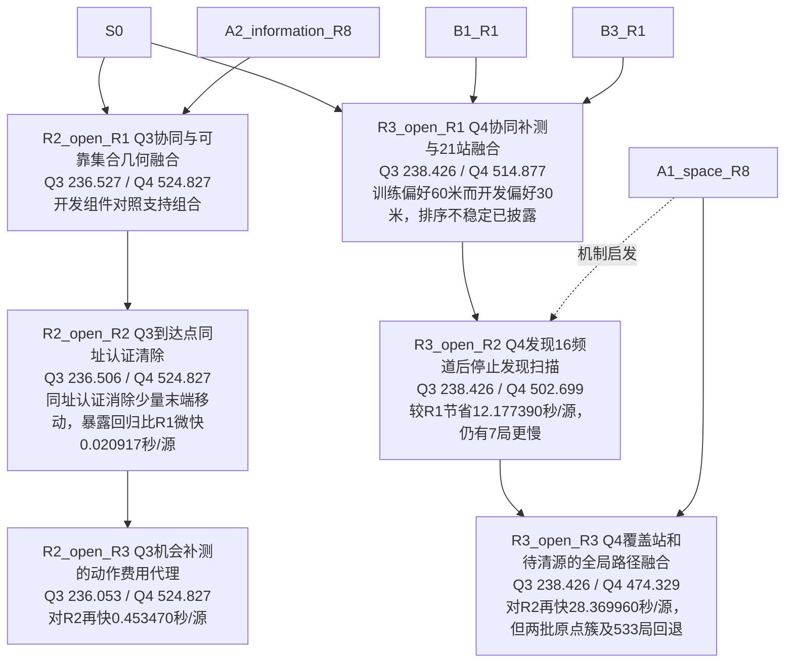

# 第三阶段冻结节点增量

只登记冻结并完成4800暴露评测的轮次；对照统一S0，节点详情另列真实设计父的逐批场景对照。R2 R3受首批DRD启发为费用代理，未实现HEC；较早独立想法与之后才收到的论文不反向归因。

|节点|合并Q3|合并Q4|真实来源及边界|
|---|---:|---:|---|
|[R2_open_R1](nodes/R2_open_R1.json)|236.527045338|524.827143981|开发组件对照支持组合；Q3两批原点簇仍退步，不能从集合收紧推单局改进。|
|[R2_open_R2](nodes/R2_open_R2.json)|236.506128826|524.827143981|同址认证消除少量末端移动，暴露回归比R1微快0.020917秒/源；主动测点降低距离却多付检测费。|
|[R3_open_R1](nodes/R3_open_R1.json)|238.426470616|514.876836277|训练偏好60米而开发偏好30米，排序不稳定已披露；24分批场景改善仍有886单局慢。|
|[R3_open_R2](nodes/R3_open_R2.json)|238.426470616|502.699446004|较R1节省12.177390秒/源，仍有7局更慢；发现上界证书不能取代clear成功证书。|
|[R2_open_R3](nodes/R2_open_R3.json)|236.052659069|524.827143981|对R2再快0.453470秒/源；新文献启发费用代理，未实现HEC。一步完成门槛失败原因仍需状态级核验。|
|[R3_open_R3](nodes/R3_open_R3.json)|238.426470616|474.329485904|对R2再快28.369960秒/源，但两批原点簇及533局回退；固定任务路径代理改善不等于每局改进。|
