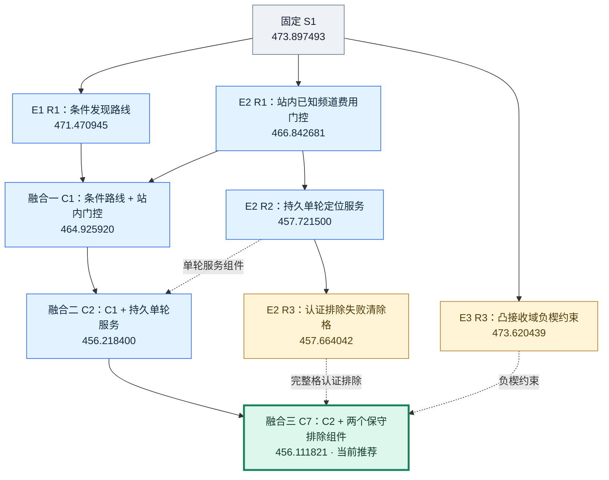
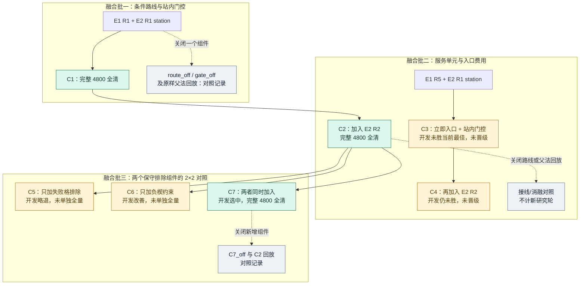

# 第四阶段方向图：主要收益、失败分支与证据范围

本轮推荐入口为 [C7](../20260911_stage4/combination/geometry_fusions/C7_both.py)：Q3 保持 **235.876946 秒/源**，Q4 从阶段起点 S1 的 **473.897493** 降到 **456.111821 秒/源**，改善 **3.7531%**。共同 4800 个已暴露本地案例全部正常退出、全部清除；每题 2400 局、30970 个源。这是研发回归，不是新留出或官方成绩。

阅读顺序：[阶段总报告](../20260911_stage4/REPORT.md) → 本图 → [AI 增量索引](stage4_increment/index.json)及其节点、来源记录。此前的 [70 节点总图](DIRECTION_MAP.md)和 [原 AI 索引](exploration_index.json)保留，本文件只说明第四阶段增量。

## 先分清“记录、部署、研究轮”

| 口径 | 数量 | 含义 |
|---|---:|---|
| 作者研究轮 | 13 | E1 五轮、E2 四轮、E3 四轮；同轮可以有多个候选或开关对照 |
| 主协调融合批次 | 3 | 先融合路线与门控，再融合单轮服务，最后比较两个保守排除组件 |
| 完成共同 4800 回归的部署 | 11 | E1 两个、E2 四个、E3 两个、主协调三个；不是 11 个作者研究轮 |
| 仅开发节点 | 14 | 保存开发结果，未给该部署补齐 4800 完整结果 |
| 对照或接线记录 | 13 | 原样父法回放、开关消融、组件接线；不计新研究轮 |
| 背景记录 | 1 | 既有 S1，复用其历史完整结果 |

本次 **39 条新增记录 = 11 个完整部署 + 14 个开发节点 + 13 个对照/接线记录 + 1 个背景记录**。不能称为 39 个新方向或 39 轮完整实验。13 个作者轮中，有完整部署的作者轮为 7 轮；E2 的第一轮有两个完整部署，主协调另有三个完整融合部署。[机器可读计数与分类](stage4_increment/index.json)保留这一边界。

## 共同 4800 案例上的主收益链

下图数字均为同一批完整 4800 案例中的 **Q4 秒/源**，越低越好；每个带成绩的部署都全清且正常退出。S1 为既有完整对照。实线表示实现或启用组件的依赖，虚线表示将该候选的局部机制移入组合；虚线不表示替换整份程序，也不表示开发成绩可以拼接成组合成绩。组合节点均有自己的实际完整执行。

主收益来自两处：站内门控减少低价值测向费用，持久单轮服务减少连续盯住同一目标的移动。C7 相对 C2 仅再减少 **0.106579 秒/源**，不能把两个排除组件描述成新的主要突破。C7 相对 S1 的 12 类 Q4 场景均值都改善，但仍有 **403 / 2400 局更慢**；均值改善不代表逐局占优。[完整分批、分题、分场景结果](../20260911_stage4/all_full_comparisons.json)

## 13 个作者轮：保留成功、失败及弱证据

这里的“未采纳”包括本批配对退步、收益很小、验证不稳定和未晋级完整回归，并不都意味着程序失败。开发取舍只相对于**同批案例中的实际对照**；不同开发批次均值不能直接排序。表内列出的具体成绩都来自共同 4800 完整回归，不展示混合开发批次成绩。

| 作者轮 | 探索的改变 | 保留结论 | 失败、弱证据或未晋级分支 |
|---|---|---|---|
| [E1 R1](stage4_increment/nodes/S4_E1_R1.json) | 把发现 16 个真实频道后可能取消的覆盖站纳入路线费用预测 | 条件发现路线完整 Q4 **471.470945**，进入融合 | 开发首批和后续批次取舍不同，未把单批成绩当确定保证；真实覆盖与退出条件始终保持 |
| [E1 R2](stage4_increment/nodes/S4_E1_R2.json) | 仅对“最后未知源”启用条件路线 | 未晋级 4800 | 保守及乐观版本均未胜同批 R1；乐观版本相对同批原父法退步 |
| [E1 R3](stage4_increment/nodes/S4_E1_R3.json) | 多个已认证清除区域联合选择落点 | 固定顺序收益很小，保留开发证据 | 重排版本退步；可用的联合落点空间很小，未晋级 4800 |
| [E1 R4](stage4_increment/nodes/S4_E1_R4.json) | 把全部未来任务视为有向定位服务块 | 未晋级 4800 | 同批两题均退步；未来入口、出口预测与实际服务流程不匹配 |
| [E1 R5](stage4_increment/nodes/S4_E1_R5.json) | 只修正当前第一任务的入口成本 | 完整 Q4 **472.058324**；Q3 **235.807805** 作为备选 | Q4 弱于条件路线；Q3 仅改善 0.0293%，v1 与旧 final 改善方向相反，6 类场景均值退步，未替换默认 Q3 |
| [E2 R1](stage4_increment/nodes/S4_E2_r1_station_only.json) | 以预期后续动作费用决定是否补测 | 站内门控 **466.842681** 优于全部停点门控 **467.405184**，两者均完整全清 | 关闭机会补测、只改机会停点门控、仅跳过已经可清除区域，都未胜选中的同批方案 |
| [E2 R2](stage4_increment/nodes/S4_E2_r2_one_round.json) | 原单源定位循环只执行一轮，再回全局调度，逐源进度持久保存 | 完整 Q4 **457.721500**，为主要新增收益 | 原地顺便清除其他已认证目标的独立对照未产生新增收益，未晋级 4800 |
| [E2 R3](stage4_increment/nodes/S4_E2_r3_failure_cells.json) | 利用真实失败 clear 的 20 米排除信息 | 完整格区域认证剔除达到 **457.664042**，仅小幅改善 | 失败圆外区域取凸包的对照在同批开发中退步；没有把 Q4 无信号误作 1000 米范围排除 |
| [E2 R4](stage4_increment/nodes/S4_E2_r4_optical_1.json) | 完整光学兜底按 1 / 3 次付费 clear 分块，保留持久待覆盖队列 | 保存开发与 quick，未晋级 4800 | 两种分块仅在 96 个新开发例中的 1 例改变，95 例原样；没有为微小收益继续扫参数 |
| [E3 R1](stage4_increment/nodes/S4_E3_R1.json) | 在已支付移动的停点，付费探测未知频道，共享初始化 | 完整 Q4 **475.131767**，全部清除但耗时退步 | 开发小幅正、完整回归负；没有把测向或未知源初始化当作免费动作 |
| [E3 R2](stage4_increment/nodes/S4_E3_R2.json) | 用其他目标的预期信息收益重排第二测点 | 未晋级 4800 | 三种权重在同批开发中均未胜父法；没有把跨目标收益代理当作可靠可行集更新 |
| [E3 R3](stage4_increment/nodes/S4_E3_R3.json) | 利用凸接收域与实际无信号，排除相容几何之外的楔形区域 | 完整 Q4 **473.620439**，微小单独收益，进入融合 | 保留原可靠集合与有限兜底；不套用全向源的无信号圆盘规则 |
| [E3 R4](stage4_increment/nodes/S4_E3_R4.json) | 条件化假想观测分支，比较单层与更深的有限树 | 保存多批开发及门槛对照，未晋级 4800 | 首批正、复测负；更深未胜浅层，成本和可见性门槛未挽救整体取舍，未继续扩树深 |

各作者完整解释：[E1 报告](../E1_refine/report.md)、[E2 报告](../E2_refine/report.md)、[E3 报告](../E3_expand/report.md)。来源阅读深度、版本更正与未实施方法见 [文献账本](../E3_expand/literature.json)和 [研究说明](../E3_expand/RESEARCH_BRIEF.md)；上述实现不冒称复现了原论文全部算法或理论保证。

## 三批融合：哪些组件没有进入推荐入口

下图不显示开发分数。“开发正”只表示相对本批对照有改善；“未单独全量”不能解释成已经通过 4800。完整组合成绩仍只引用前面的主收益链。

| 融合批次 | 实际筛选与完整结果 | 没有采用的分支说明 |
|---|---|---|
| 第一批 | 条件路线 + 站内门控 → [C1](stage4_increment/nodes/S4_ROOT_C1_combined.json)，完整 Q4 **464.925920** | 开关关闭和父法回放用于确认接线；不是额外完整研究轮 |
| 第二批 | C1 + 持久单轮服务 → [C2](stage4_increment/nodes/S4_ROOT_C2_conditional_round.json)，完整 Q4 **456.218400** | [C3](stage4_increment/nodes/S4_ROOT_C3_entry_station.json)、[C4](stage4_increment/nodes/S4_ROOT_C4_entry_round.json)未胜同批最佳，未晋级；不能假设入口费用与单轮服务直接叠加必然有益 |
| 第三批 | C2、仅失败格、仅负楔、二者的同批 2×2 对照 → [C7](stage4_increment/nodes/S4_ROOT_C7_both.json)，完整 Q4 **456.111821** | [C5](stage4_increment/nodes/S4_ROOT_C5_cells.json)开发略退；[C6](stage4_increment/nodes/S4_ROOT_C6_wedge.json)开发正但未单独完成 4800。只有 C7 被选中晋级，不能把 C5 / C6 标成完整部署 |

## 如何接续这一张图

本轮按实际反例、收益微小、触发稀少和流程不匹配收束，不是全局最优证明。全部实际策略任务为 **65880 次**；作者开发、父法对照、开关尝试和完整部署都在其中，不能当作 65880 个独立案例。来源、预算和证据边界以 [总报告](../20260911_stage4/REPORT.md)、[执行预算](../20260911_stage4/execution_budget.json)、[增量来源清单](stage4_increment/manifest.json)为准。

后续可按“当前入口 → 相关失败机制 → 同批对照 → 源码/原始结果”阅读 [增量索引](stage4_increment/index.json)。保留失败分支是为了避免换名字重复同一机制；未实现的全套 PHD/TD3、多机器人方法，以及官方分布和真实通信性能，不能从当前本地结果中推定。本文件未运行策略、未重算历史指标，也没有改写此前 70 节点文件。
